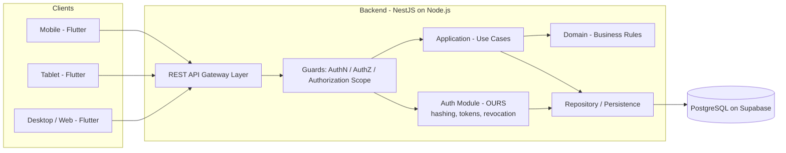
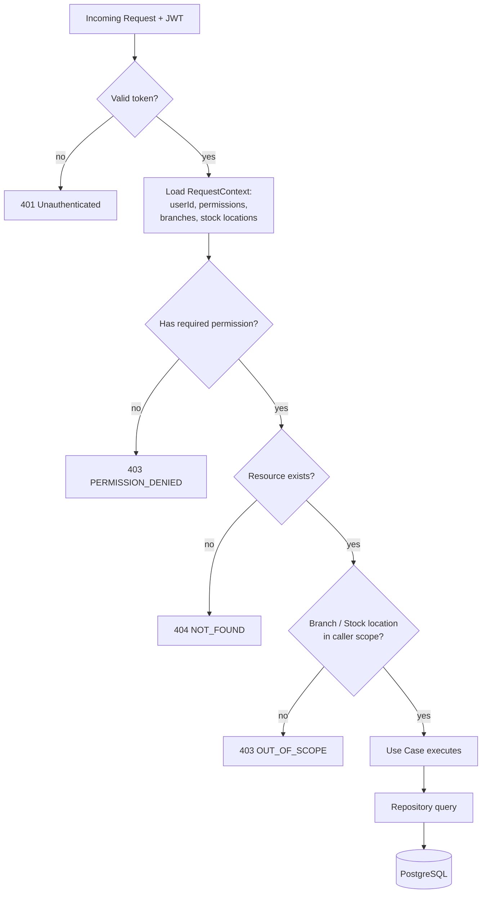
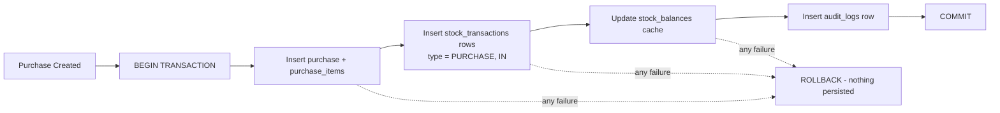

# ARCHITECTURE.md — System Architecture

**Status:** Active (Phase 0) · **Owner:** Architecture team
**Related:** `BACKEND_RULES.md`, `FLUTTER_RULES.md`, `DATABASE_RULES.md`,
`docs/architecture/ORGANIZATION_AND_SCOPE.md`, ADR-001, ADR-008, **ADR-013**, **ADR-014**

---

## 1. Current State of the Repository (read this first)

As of Phase 0 kick-off, the repository contains **only a Flutter application** (`pubspec.yaml` declares
`name: frontend`) sitting at the repository root, with:

- ~11,700 lines of Dart across `lib/`
- an in-memory `lib/shared/services/mock_database_service.dart` (~1,300 lines) acting as a fake database
- screens for **all** phases, including Production, Sales, Projects, Commission and Reports
- one Flutter smoke test in `test/`
- **no backend, no database, no migrations, no authentication**

Per **ADR-010** (approved) this implementation is **retained** as existing project work and reference — not
deleted and not frozen. It carries real value: a validated design system, a navigation model and terminology
already reviewed with the client.

But it predates the architecture in this document. **Do not assume existing code follows the approved
architecture, and do not use it as a pattern for new work.** New development follows §4 and §5 below;
existing functionality is not rewritten unless a specific Jira task requires it. See **ADR-001** for the
target repository layout.

---

## 2. Technology Flow (authoritative — confirmed by the CTO)

This is the mandated stack and the mandated direction of dependency. No component may be skipped, and no
component may be substituted without an ADR.

```
┌──────────────────────────────┐
│        Flutter + Dart        │
│         Responsive UI        │
└──────────────┬───────────────┘
               │
             REST
               │
┌──────────────▼───────────────┐
│      NestJS + TypeScript     │
│          Backend API         │
├──────────────────────────────┤
│ Auth                         │
│ Authorization / RBAC         │
│ Access Control / Scope       │
│ Business Logic               │
│ Stock Transactions           │
│ Audit                        │
│ Validation                   │
│ TDD                          │
└──────────────┬───────────────┘
               │
          Repository
               │
┌──────────────▼───────────────┐
│          PostgreSQL          │
│           Supabase           │
└──────────────────────────────┘
```

Linear form:

```
Flutter → REST API → NestJS → Node.js → PostgreSQL → Supabase
```

**What this diagram fixes as law:**

| Rule | Consequence |
| --- | --- |
| Flutter's **only** downstream dependency is our REST API | No Supabase client, no SQL, no direct database access in `lib/` |
| Every one of the eight backend concerns lives in **NestJS**, not in Flutter and not in the database | Auth, RBAC, access control and scope, business logic, stock transactions, audit, validation and TDD are backend responsibilities |
| PostgreSQL is reached **only** through the Repository layer | No raw SQL in controllers, use cases or domain code |
| Supabase is the **hosting platform** for PostgreSQL, not an application layer | **Supabase Auth is not used** — authentication is owned by our NestJS backend (ADR-003), so the product stays portable to another database or provider |

The eight items listed inside the NestJS box are exactly the Phase 0 foundation deliverables
(`DEVELOPMENT_WORKFLOW.md` §7). If a feature needs one of them, it belongs on the server.

---

## 3. Target System Architecture



**Key points:**

1. The Flutter client talks **only** to our NestJS backend. It must **never** connect directly to
   Supabase/PostgreSQL for business data, and must never hold a Supabase service-role key or any database
   credential (`SECURITY_RULES.md` §4).
2. **Authentication is ours** (ADR-003). Supabase Auth is not used. Our backend owns user records, password
   hashing, login, token issuance, validation and revocation — so the product can move to another database
   or infrastructure provider with minimal impact. Supabase is the PostgreSQL host, nothing more.

---

## 4. Backend Layered Architecture (NestJS)

The mandated request path — no layer may be skipped:

```
Controller
  → Guard / Auth            (authentication, permission, authorization scope)
    → Validation            (DTO + class-validator, whitelist + forbid unknown)
      → Application / Use Case
        → Domain / Business Logic
          → Repository
            → PostgreSQL
```

### 4.1 Responsibility of each layer

| Layer | Responsible for | Must NOT do |
| --- | --- | --- |
| **Controller** | HTTP concerns only: route, status code, response shape. Thin. | Business rules, SQL, access checks written by hand |
| **Guard / Auth** | Verify our JWT, load the user permissions and branch / stock-location scope, attach a trusted `RequestContext` | Read the request body to decide scope |
| **Validation (DTO)** | Shape, type, range, required fields | Database lookups, cross-entity business rules |
| **Application / Use Case** | Orchestration: load entities, invoke domain rules, manage the DB transaction boundary, emit audit events | Contain deep business rules that belong in Domain |
| **Domain** | The business rules from the source document; pure, framework-free, easy to unit test | Import NestJS, HTTP, or the database client |
| **Repository** | Data access, mapping rows to domain objects, respecting the caller scope | Business decisions |

### 4.2 Why this exists (for freshers)

If business rules sit in the controller, they can only be tested by making an HTTP call, they get duplicated
the moment a second entry point appears (a background job, an import), and reviewers cannot tell the
difference between "HTTP plumbing" and "the company's money rules". Separating them means the rule
*"a purchase must increase raw material stock by exactly the received quantity"* lives in one file, has one
unit test, and cannot be accidentally bypassed.

### 4.3 Module structure

Each business module is a NestJS module, self-contained:

```
src/modules/<module-name>/
├── <module-name>.module.ts
├── api/                      # controllers + DTOs (request/response)
│   ├── <name>.controller.ts
│   └── dto/
├── application/              # use cases, one class per use case
│   └── create-<thing>.use-case.ts
├── domain/                   # entities, value objects, domain services, errors
│   ├── <thing>.entity.ts
│   └── <thing>.rules.ts
├── infrastructure/           # repository implementations, external adapters
│   └── <thing>.repository.ts
└── __tests__/                # unit + integration tests for this module
```

Cross-module access happens **only** through an exported application service or use case — never by importing
another module's repository or reaching into its tables directly.

### 4.4 Shared/platform modules

```
src/core/
├── auth/           # our token issue/verify, RequestContext, guards, decorators
├── access/         # permission catalogue, branch and stock-location scope resolution
├── database/       # connection, transaction manager, base repository
├── errors/         # domain error base classes + global exception filter
├── logging/        # structured logger, request correlation id
├── audit/          # audit log writer
└── common/         # pagination, money value object, id generation
```

---

## 5. Flutter Layered Architecture

The mandated path:

```
Presentation (Widgets/Screens)
  → State Management (Riverpod)
    → Domain (entities + use cases, pure Dart)
      → Data (repositories, DTOs, mappers)
        → API Client (HTTP)
          → Backend
```

### 5.1 Folder structure (target)

```
lib/
├── app/                     # bootstrap, router, theme, constants  (EXISTS - keep)
├── core/                    # shared widgets, utils, errors, network  (EXISTS - refactor)
│   ├── network/             # api client, interceptors, error mapping  (NEW)
│   ├── errors/              # Failure types                            (NEW)
│   └── widgets/             # design system widgets                    (EXISTS)
└── features/
    └── <feature>/
        ├── presentation/    # screens + widgets
        ├── application/     # Riverpod providers / notifiers
        ├── domain/          # entities, value objects, repository interfaces
        └── data/            # repository impl, DTOs, mappers
```

> **Migration note.** Today `lib/features/*/screens/*.dart` read directly from `MockDatabaseService`.
> That is a two-layer app (UI → fake DB). The target is five layers. Feature-by-feature migration is
> defined in **ADR-010**; nothing is migrated until the corresponding backend API exists.

### 5.2 Non-negotiables

- **No business logic in widgets.** A widget may format and display. It may not decide whether a purchase is
  valid, compute a stock balance, or apply a commission slab.
- **No `MockDatabaseService` in production code paths** once a real repository exists for that feature.
- **Domain layer is pure Dart** — no Flutter imports. This makes it unit-testable without a widget tester.
- The client is **not** a security boundary. Hiding a button is UX, not authorization.

---

## 6. Organization, Access Control & Stock Scope

Summary here; the full design is `docs/architecture/ORGANIZATION_AND_SCOPE.md`, **ADR-013** and **ADR-014**.

> **Superseded 2026-08-29.** This section previously described a **multi-tenant** architecture
> (`company_id` discriminator + RLS + composite FKs). **The SaaS requirement was withdrawn** (ADR-014).
> The ERP is built for **one client**, deployed as a **dedicated instance**; separation between clients is
> achieved by separate deployments with separate databases. **Do not implement tenant isolation.**

- **Deployment model:** one client, one instance, one database (ADR-014).
- **"Company" is an organizational entity** — the client's own business — not a SaaS tenant.
- **Branch and Warehouse are optional** (ADR-013). Stock is anchored to a `stock_location_id`, which is
  always `NOT NULL` and resolves to company, branch or warehouse level per the client's configuration.
- **What remains mandatory is authorization**, not tenant isolation:
  1. **Permission** — every endpoint declares one; deny by default (ADR-004).
  2. **Resource access** — may this user act on *this* record?
  3. **Scope** — is the branch / stock location within the caller's assignment?
- **Scope resolution:** permissions, branch ids and stock-location ids are derived from the **verified token**
  on the server. They are **never** read from the request body, query string or headers.



> **Changed from the superseded design:** an existing resource the caller may not act on now returns
> **`403`, not `404`.** Hiding existence was a *cross-tenant* concern; within one organization a user may
> legitimately know a record exists while being denied access. `404` now means genuinely not found.

---

## 7. Stock Transaction Architecture

The single most important data-integrity rule in this product (source document §21, ADR-005).

- `stock_transactions` is an **append-only ledger**. Rows are inserted, never updated, never deleted.
- A "current stock" figure is **derived** from the ledger. It may be *cached* in a balance table for
  performance, but the ledger remains the source of truth and the cache must be reconstructible.
- Every ledger row carries: company, branch, warehouse, item, item type, transaction type, reference
  document, quantity in, quantity out, and who performed it.
- Every ledger row is written **inside the same database transaction** as the document that caused it.
  A purchase that saves but fails to post stock — or vice versa — is a data-corruption bug.



Corrections never rewrite history. To fix a wrong purchase quantity you post a compensating transaction
(`ADJUSTMENT` or `PURCHASE_RETURN`), preserving the audit trail.

---

## 8. Error Handling Architecture

- The domain raises **typed domain errors** (`InsufficientStockError`, `DuplicateItemCodeError`, …) that know
  nothing about HTTP.
- A single NestJS **global exception filter** maps domain errors to HTTP status codes and to the standard
  error envelope defined in `API_CONVENTIONS.md`.
- Internal details (stack traces, SQL, driver messages) are **logged**, never returned to the client.
- The Flutter data layer maps HTTP errors to `Failure` objects; the presentation layer maps `Failure` to a
  human message. Widgets never see raw HTTP.

Full detail: `docs/architecture/ERROR_HANDLING.md`.

---

## 9. Logging & Audit Architecture

Two separate concerns — do not conflate them:

| | **Logging** | **Audit** |
| --- | --- | --- |
| Purpose | Diagnose technical problems | Prove who changed business data |
| Audience | Engineers | Business, compliance, the customer |
| Storage | Log stream | `audit_logs` table in PostgreSQL |
| Retention | Short | Long — treat as business data |
| Content | Structured JSON, correlation id, no PII/secrets | Actor, company, action, entity, before/after, reason, timestamp |

Full detail: `docs/architecture/LOGGING_AND_AUDIT.md`.

---

## 10. Architectural Boundaries — Hard Rules

1. Flutter never talks to PostgreSQL/Supabase directly for business data.
2. Controllers never contain business rules.
3. Domain never imports NestJS, HTTP or the database client.
4. Repositories never make business decisions.
5. No module imports another module's repository or entities directly.
6. No raw SQL outside the repository/infrastructure layer.
7. No protected operation without a permission check and a scope check.
8. No new third-party dependency without an ADR.
9. No new architectural pattern "just for this module" without an ADR.

A pull request violating any of these is rejected regardless of whether the tests pass.

---

## 11. Deployment Topology (Phase 0 outline)

```
Flutter app (mobile stores / web hosting)
        │  HTTPS, Bearer JWT
        ▼
NestJS API  (containerised; env-injected secrets)
        │  pooled connection, least-privilege DB role
        ▼
Supabase PostgreSQL  (single client database; migrations applied via CI)
```

Environments: `local` → `dev` → `staging` → `production`. Schema changes reach any environment **only**
through committed migrations run by CI. Manual changes in the Supabase dashboard are forbidden outside
`local`. See `DATABASE_RULES.md` §7 and `GIT_WORKFLOW.md` §7.
