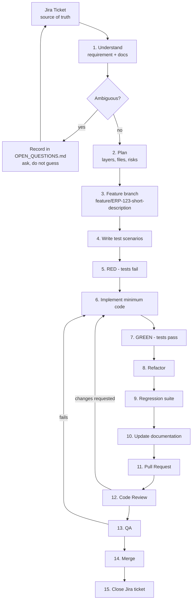

# DEVELOPMENT_WORKFLOW.md — From Jira Ticket to Merged Code

**Status:** Active · **Related:** `GIT_WORKFLOW.md`, `TESTING_RULES.md`, `PROJECT_RULES.md`

---

## 1. The Complete Lifecycle



**Jira is the source of truth for development tasks.** No ticket, no branch, no code.

---

## 2. Step-by-Step

### Step 1 — Understand the requirement

Read the ticket, then:

| Read this | To answer |
| --- | --- |
| `docs/business/STOCK_MANAGEMENT_SOURCE_DOCUMENT.md` | What does the business actually want? |
| `docs/modules/<module>/REQUIREMENTS.md` and `BUSINESS_RULES.md` | What are the exact rules and edge cases? |
| `docs/modules/<module>/API_SPECIFICATION.md` | What contract am I implementing? |
| `ARCHITECTURE.md` | Which layer does this belong in? |
| Existing code and tests | What already exists that I should reuse? |

Write one sentence describing the expected behaviour. If you cannot, the ticket is not ready — send it back.

### Step 2 — Plan

Post the plan as a Jira comment before coding. It contains:

- Affected modules and layers
- Files to create / modify, in order
- The test scenario list (from `TESTING_RULES.md` §2 Step 2)
- Security considerations: which permission, which branch / stock-location scope
- Data-integrity considerations: transaction boundary, constraints, migrations needed
- Anything that requires a human decision

Non-trivial changes are not started without a reviewed plan. This is cheaper than reviewing wrong code.

### Step 3 — Branch

```bash
git checkout develop
git pull
git checkout -b feature/ERP-104-purchase-entry
```

Naming and commit rules: `GIT_WORKFLOW.md`.

### Steps 4–9 — The TDD cycle

Follow `TESTING_RULES.md` §2 exactly. In short:

```bash
# 4 + 5: write tests, then observe RED
npm run test -- purchases          # must FAIL for the right reason

# 6 + 7: implement, then GREEN
npm run test -- purchases          # must PASS

# 8: refactor, re-run
npm run test -- purchases

# 9: regression
npm run test && npm run test:e2e
```

Capture the RED and GREEN output — it goes in the PR description.

### Step 10 — Update documentation

Documentation is part of the change, not an afterthought. Update whichever applies:

| If you changed… | Update… |
| --- | --- |
| An API contract | `docs/modules/<module>/API_SPECIFICATION.md` |
| A business rule interpretation | `docs/modules/<module>/BUSINESS_RULES.md` |
| The schema | `docs/modules/<module>/DATABASE_DESIGN.md` + a migration |
| A screen flow | `docs/modules/<module>/UI_FLOW.md` |
| Test scenarios | `docs/modules/<module>/TEST_CASES.md` |
| An architectural or technology decision | a new ADR in `docs/decisions/` |

### Step 11 — Pull Request

Use the PR template in `GIT_WORKFLOW.md` §5. A PR without the TDD evidence section is rejected without review.

### Step 12 — Code review

See the reviewer checklist in `GIT_WORKFLOW.md` §5.3. Reviewers check architecture, security and tests —
not only whether the code reads nicely.

### Step 13 — QA

QA verifies behaviour against the ticket's acceptance criteria and the business document, including at least
one negative path and one permission path. QA is not "the screen opened".

### Step 14–15 — Merge and close

Squash-merge into `develop`, delete the branch, move the Jira ticket to Done only when every
Definition of Done box in `PROJECT_RULES.md` §7 is ticked.

---

## 3. Definition of Ready (before a ticket enters a sprint)

A ticket is Ready only when:

- [ ] It states the business need, not just a UI request
- [ ] Acceptance criteria are written and testable
- [ ] It traces to a section of the business source document (or is explicitly Phase 0 technical work)
- [ ] Ambiguities are resolved or explicitly listed
- [ ] It belongs to the **current phase**
- [ ] Dependencies (APIs, schema, other tickets) are identified
- [ ] It is small enough to review in one sitting — split it otherwise

---

## 4. Definition of Done

The authoritative checklist lives in `PROJECT_RULES.md` §7. Do not maintain a second copy.

---

## 5. Working Agreements

1. **Small PRs.** One ticket, one concern. A 2,000-line PR does not get a real review.
2. **No direct commits to `main` or `develop`.**
3. **Ask early.** A question on day one costs minutes; a wrong data model costs weeks.
4. **Report blockers the same day.**
5. **Never push a red pipeline and "fix it later".**
6. **If you find an unrelated bug**, file a ticket — do not fix it in your branch.
7. **If a rule blocks you and seems wrong**, raise it. Rules change through ADRs, not through exceptions in
   a pull request.

---

## 6. Escalation Path

| Situation | Escalate to | Output |
| --- | --- | --- |
| Ambiguous business requirement | Business Analyst → Client | Entry in `docs/business/OPEN_QUESTIONS.md`, then a decision |
| Architectural choice | Architect | ADR in `docs/decisions/` |
| Security concern | Security Architect | Immediate; P0 if access control is involved |
| Schema change with data impact | Database Architect | Reviewed migration + rollback plan |
| Scope creep / future-phase request | Product Owner | Ticket deferred to its phase |

---

## 7. Phase 0 Task Sequence (current work)

Phase 0 must be completed before any Phase 1 feature ticket starts. Recommended order:

| # | Task | Depends on |
| --- | --- | --- |
| 1 | Documentation & governance baseline (this set of documents) | — |
| 2 | Repository restructure into `apps/backend` + `apps/frontend` (ADR-001) | 1 |
| 3 | NestJS project scaffold, config, health endpoint | 2 |
| 4 | Test harness: Jest, Supertest, test PostgreSQL, factories, role/scope fixtures | 3 |
| 5 | Migration tooling + first migration: `companies` (incl. `stock_scope_level`), `branches` *(optional)*, `warehouses` *(optional)*, **`stock_locations`** (ADR-013), `users` (incl. `password_hash`), `refresh_tokens`, `roles`, `permissions`, `role_permissions`, `user_company_roles` | 4 |
| 6 | **Authentication — ours** (ADR-003): login, password hashing, token issue/verify, refresh rotation + revocation, rate limiting, lockout, `RequestContext`. **Senior review required** | 5 |
| 7 | Authorization (permission guard, decorators) + **Role/Permission CRUD API and screens** with the lockout guard — ADR-004 | 6 |
| 8 | Permission guard + resource-level access checks + branch / stock-location scope resolution — ADR-004, ADR-013, ADR-014 | 7 |
| 9 | Error handling, global exception filter, error envelope | 3 |
| 10 | Structured logging + correlation ids | 9 |
| 11 | Audit log architecture and writer | 8 |
| 12 | CI pipeline: lint, typecheck, test, migration check, coverage gate | 4 |
| 13 | Access-control test suite: 401 unauthenticated, 403 unauthorized, 403 out-of-scope, **plus stock-scope tests for all three organizational shapes** (company-level, branch-level, warehouse-level) | 8 |

Task 13 is the Phase 0 exit criterion: **Phase 1 does not start until a test proves access control works.**

> **Blocked in parallel:** the Phase 1 *migration* additionally waits on **Q-05** (discount / GST / rounding)
> — see `docs/business/OPEN_QUESTIONS.md`. Phase 0 tasks 1–13 are not blocked by it and should proceed.
