# GIT_WORKFLOW.md — Branching, Commits, PRs and CI

**Status:** Active · **Related:** `DEVELOPMENT_WORKFLOW.md`, `TESTING_RULES.md`

---

## 1. Branch Model

| Branch | Purpose | Protected |
| --- | --- | --- |
| `main` | Production. Always deployable. | **Yes** |
| `dev` | Integration branch for the current phase. | **Yes** |
| `feature/*` | One Jira ticket | No |
| `bugfix/*` | A defect on `dev` | No |
| `hotfix/*` | An urgent production fix, branched from `main` | No |
| `chore/*` | Tooling, docs, CI — no product behaviour change | No |

> The repository currently has `main` and `dev`. `dev` is our integration branch; where other documents say
> "develop", they mean this `dev` branch.

**Never commit feature work directly to `main` or `dev`.** Both require a pull request.

---

## 2. Branch Naming

```
<type>/ERP-<ticket>-<short-description>
```

```
feature/ERP-104-purchase-entry
feature/ERP-118-vendor-master-crud
bugfix/ERP-131-stock-balance-rounding
hotfix/ERP-140-missing-permission-check-on-vendor-list
chore/ERP-101-ci-pipeline
```

Rules: lowercase, hyphen-separated, the Jira id is **mandatory**, keep it under ~50 characters,
one branch per ticket.

---

## 3. Commit Messages

```
ERP-104: Add purchase entry API
```

Format: `ERP-<ticket>: <imperative summary>`

- Imperative mood — "Add", not "Added" or "Adding".
- Summary ≤ 72 characters, no trailing period.
- A body (after a blank line) explains **why**, not what — the diff already shows what.

```
ERP-104: Add purchase entry API

Posts stock IN transactions in the same database transaction as the
purchase so a partial write cannot leave the ledger inconsistent.

Refs: docs/modules/stock-management/BUSINESS_RULES.md BR-PUR-003
```

Bad commits: `fix`, `wip`, `update code`, `changes as discussed`, `asdf`.

Commit in logical units. "Add failing tests for purchase creation" followed by "Implement purchase creation"
is a **good** history — it shows the TDD cycle in the repository itself.

---

## 4. Full Workflow

```mermaid
flowchart LR
    J[Jira Ticket] --> B[Feature Branch]
    B --> T[TDD Tests]
    T --> R[RED]
    R --> I[Implementation]
    I --> G[GREEN]
    G --> RF[Refactor]
    RF --> RG[Regression Tests]
    RG --> PR[Pull Request]
    PR --> CR[Code Review]
    CR --> QA[QA]
    QA --> M[Merge to dev]
```



```bash
git checkout dev && git pull
git checkout -b feature/ERP-104-purchase-entry
# ... TDD cycle ...
git push -u origin feature/ERP-104-purchase-entry
# open PR against dev
```

Rebase onto `dev` to keep history linear; do not rebase a branch someone else is working on.
Merge to `dev` with **squash** so each ticket is one commit on the integration branch.

---

## 5. Pull Requests

### 5.1 Rules

- One ticket per PR. Keep it focused.
- Target `dev` (or `main` for a hotfix).
- Preferably under ~400 changed lines. A 2,000-line PR does not receive a real review.
- No mixing refactors with features — separate PRs.
- Draft PRs are welcome for early feedback.
- The author never approves their own PR.

### 5.2 PR template

```markdown
## Ticket
ERP-104 — <title>   (link)

## What & Why
<what changed, and which business rule or ticket requires it>

## TDD Evidence  (mandatory — PR is rejected without it)
**RED**
```
$ npm run test -- purchases
FAIL  src/modules/purchases/__tests__/create-purchase.spec.ts
  ● creates stock IN transactions for each purchase line
    CreatePurchaseUseCase is not defined
Tests: 7 failed, 0 passed
```
**GREEN**
```
$ npm run test -- purchases
Tests: 7 passed, 7 total
```
**Regression**
```
$ npm run test && npm run test:e2e
Tests: 214 passed
```

## Security & Tenancy
- Permission: `purchase.create`
- Scope enforced at: permission guard + use case scope check
- Access-control tests: `returns 403 without purchase.create`, `returns 403 for an out-of-scope location`

## Database
- Migration: `20260901120000_create_purchases.sql`
- Rollback plan: <...>

## Documentation
- [ ] API_SPECIFICATION.md updated
- [ ] BUSINESS_RULES.md updated
- [ ] ADR added (if a decision was made)

## Checklist
- [ ] Tests written before implementation, RED observed
- [ ] No `company_id` from client input
- [ ] Money/quantity use decimal types
- [ ] Multi-row writes in one transaction
- [ ] No unrelated files touched
- [ ] No new dependency without an ADR
```

### 5.3 Reviewer checklist

**Architecture** — correct layer? no logic in controllers/widgets? no cross-module repository imports?
**Security** — permission declared? scope from token only? **403** (not 404) for an existing out-of-scope resource?
no secrets? validation whitelist on?
**Data** — decimal money? transaction boundary correct? constraints and indexes present? no cascade delete on
history? migration reversible?
**Tests** — RED evidence present? tests assert behaviour, not mocks? access-control tests exist?
negative paths covered? nothing skipped or weakened?
**Business** — matches the source document? terminology preserved? no invented requirement?
**Quality** — naming, dead code, no `any`, no `console.log`, docs updated.

Reviewers must actually run the branch for anything non-trivial. "LGTM" without reading the diff is not a
review.

---

## 6. CI Gates (must pass before merge)

| # | Gate | Blocks merge |
| --- | --- | --- |
| 1 | Lint (ESLint / `flutter analyze`) — zero warnings | Yes |
| 2 | Type check (`tsc --noEmit`) | Yes |
| 3 | Unit tests | Yes |
| 4 | Integration tests (real PostgreSQL) | Yes |
| 5 | E2E/API tests | Yes |
| 6 | Coverage thresholds (`TESTING_RULES.md` §3.2) | Yes |
| 7 | Migrations apply cleanly to a scratch database | Yes |
| 8 | Secret scan | Yes |
| 9 | Dependency audit (high/critical) | Yes |
| 10 | Build (backend + Flutter) | Yes |

**Never merge a red pipeline.** Never disable a gate to unblock yourself — fix the cause or escalate.

---

## 7. Releases and Environments

| Environment | Source | Deploy |
| --- | --- | --- |
| `local` | working branch | developer machine |
| `dev` | `dev` | automatic on merge |
| `staging` | release branch / `main` candidate | manual approval |
| `production` | `main` | manual approval, tagged |

- Tag releases `v<major>.<minor>.<patch>`.
- Schema changes reach any shared environment **only** through committed migrations run by CI.
  Manual edits in the Supabase dashboard outside `local` are forbidden.
- Every release records: tickets included, migrations applied, rollback plan.

### Hotfix

```bash
git checkout main && git pull
git checkout -b hotfix/ERP-140-missing-permission-check
# fix + regression test that reproduces the bug first
```
Merge to `main`, tag, deploy, then merge `main` back into `dev` immediately so the fix is not lost.

A hotfix still requires a test. A security hotfix requires a test that **fails before the fix**.

---

## 8. What Must Never Be Committed

- `.env` files, secrets, service-role keys, connection strings, private keys
- `node_modules/`, `build/`, `.dart_tool/`, generated artefacts
- Real customer data or production database dumps
- Large binaries (use an artefact store)
- Commented-out blocks of dead code
- Debug code: `console.log`, `print`, `debugger`, `.only` on a test

If a secret is ever committed: **rotate it immediately**, then clean history. Removing the file in a later
commit does not make it secret again.
