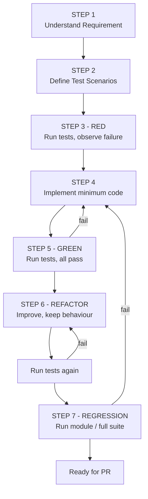

# TESTING_RULES.md — Mandatory TDD Workflow & Test Quality Rules

**Status:** Active · **Applies to:** all backend work (mandatory), all shared frontend logic (mandatory),
UI widgets (recommended)
**Related:** `DEVELOPMENT_WORKFLOW.md`, `AI_CODING_RULES.md`, ADR-009

---

## 1. Why We Test First (for freshers)

We are building an ERP. If a stock balance is wrong, the customer orders material they already have, or sells
material they do not have. If authorization breaks, a store keeper can approve their own purchases, or post
stock into a branch they were never assigned to. Neither failure is visible on screen — the UI looks perfect
in both cases.

Tests are how we make **invisible correctness** visible.

Writing the test **first** does three things a test-after-the-fact cannot:

1. It forces you to state the expected behaviour before you are attached to an implementation.
2. The **RED** run proves the test can actually fail — a test that never failed has never been validated.
3. It stops "the code does what the code does" tests, where you read your own implementation and assert it.

---

## 2. The Mandatory Backend TDD Cycle

Every **new API, use case, business rule or important backend change** follows all seven steps.



### STEP 1 — Understand the requirement

Read, in this order:

- the Jira ticket and its acceptance criteria
- `docs/business/STOCK_MANAGEMENT_SOURCE_DOCUMENT.md` (the relevant section)
- `docs/modules/<module>/BUSINESS_RULES.md` and `API_SPECIFICATION.md`
- the existing code you will touch
- the existing tests for that area

If after reading you cannot state the expected behaviour in one sentence, **stop and ask**.

### STEP 2 — Define test scenarios

Before writing implementation code, write the test cases. Cover every applicable row:

| Category | Example for `POST /purchases` |
| --- | --- |
| Happy path | Valid purchase creates the purchase, its items, and stock IN transactions |
| Validation failure | Quantity `0` or negative is rejected with 422 |
| Authentication failure | No/invalid token returns 401 |
| Authorization failure | User without `purchase.create` returns 403 |
| **Resource authorization** | A user cannot act on a purchase belonging to a branch outside their scope |
| Branch access | User not assigned to the branch is rejected |
| Stock location access | Stock cannot be posted to a location outside the user scope |
| Invalid IDs | Malformed UUID returns 422, not 500 |
| Not found | Unknown vendor id returns 404 |
| Duplicate records | Same vendor invoice number for the same vendor is rejected |
| Database constraints | FK violation surfaces as a domain error, not a raw driver error |
| Business rule violations | Cannot post stock for a soft-deleted raw material |
| **Transaction rollback** | If stock posting fails, the purchase is not persisted |
| **Role de-privileging (Negative)** | Removing permissions from a role immediately restricts access, drops from `/auth/me`, and returns 403 on API |
| **Lifecycle persistence & UI hide** | Saved permission changes persist across re-login and dynamically hide restricted UI navigation modules |
| Edge cases | Zero-line purchase, very large quantity, boundary of credit limit |
| Important calculations | Line total, discount, GST, purchase total, pending amount |

Write them as a list in the ticket *and* as test names in code. A test name is a sentence:

```ts
it('rejects a purchase posted to a stock location outside the user scope', ...)
it('does not persist the purchase when stock posting fails', ...)
```

Not: `it('works', ...)`, `it('test 2', ...)`.

### STEP 3 — RED phase (this step is not optional)

Run the newly written tests **before** any implementation exists.

```bash
npm run test -- purchases
```

Expected outcome: the tests **fail**, and they fail for the **right reason** (the behaviour is missing), not
because of a typo, a missing import or a broken test harness.

Record the RED output in the PR description. This is the evidence that the tests are real.

> **If a new test passes before you implement anything, the test is wrong.** It is asserting something that
> was already true. Fix the test — do not celebrate.

Never weaken or delete a test to reach a green state.

### STEP 4 — Implementation

Write the **minimum** production code that satisfies the tests, following the architecture in
`ARCHITECTURE.md` and `BACKEND_RULES.md`.

- Put the rule in the Domain layer, the orchestration in the Use Case, the HTTP in the Controller.
- Do not implement functionality the tests do not require.
- Do not "while I'm here" refactor an unrelated file.

### STEP 5 — GREEN phase

Run the same tests again. **All required tests must pass.** If one does not, fix the *code* — not the test —
unless the test itself encoded a misunderstanding of the requirement, in which case correct the test and say
so explicitly in the PR.

### STEP 6 — Refactor

Only after green:

- remove duplication
- improve naming
- extract a value object or a domain service if the rule deserves a home
- keep the architecture clean

**Behaviour must not change.** Run the tests again after refactoring.

### STEP 7 — Regression

Run the broader suite for the affected module, and before merge the full backend suite:

```bash
npm run test              # unit + integration
npm run test:e2e          # API level
```

CI enforces this on every PR (`GIT_WORKFLOW.md` §6). A red pipeline blocks merge.

---

## 3. Test Quality Rules

### 3.1 Test behaviour, not implementation

```ts
// ❌ BAD - couples the test to the implementation. Refactoring breaks it
//          even though behaviour is unchanged.
expect(repository.save).toHaveBeenCalledWith(expect.any(PurchaseEntity));

// ✅ GOOD - asserts the observable outcome the business cares about.
const balance = await stockLedger.balanceFor(rawMaterialId, stockLocationId);
expect(balance).toEqual(new Decimal('100'));
```

### 3.2 Coverage is a symptom, not a goal

We do not write tests to raise a number. A suite at 90% coverage that never asserts an authorization failure
is worse than a suite at 60% that does — because it produces false confidence.

Coverage thresholds exist as a floor to catch untested files, not as a target to game:

| Area | Floor |
| --- | --- |
| Domain / business rules | 90% |
| Use cases | 85% |
| Repositories | covered by integration tests |
| Controllers | covered by e2e tests |
| Flutter domain + data | 80% |

### 3.3 Security tests are mandatory

Every protected endpoint has, at minimum:

1. an **unauthenticated** test → 401
2. an **insufficient permission** test → 403
3. an **unauthorized resource access** test → `403` (an existing resource the caller may not act on)

> **Changed 2026-08-29 (ADR-014).** Item 3 was previously "a cross-tenant test → 404". **The project is not
> multi-tenant. Do not write tenant-isolation tests** — there is no second tenant to isolate from, and such a
> test would assert a behaviour the system does not have. Test **resource-level authorization** instead.

### 3.4 The access-control test that must exist everywhere

For every protected resource, an explicit test in this shape:

```ts
describe('access control', () => {
  it('refuses a stock post into a location outside the user scope', async () => {
    const { token }      = await seedUserWithScope({ locations: ['L1'] });
    const { locationL2 } = await seedStockLocation('L2');

    const res = await api.post('/stock-adjustments')
      .auth(token)
      .send({ stockLocationId: locationL2.id, /* … */ });

    expect(res.status).toBe(403);                       // existing resource, access denied
    expect(res.body.error.code).toBe('STOCK_LOCATION_OUT_OF_SCOPE');
  });

  it('refuses an action the role does not hold the permission for', async () => {
    const { token } = await seedUserWithPermissions(['purchase.view']);   // no purchase.create

    const res = await api.post('/purchases').auth(token).send(validPayload);

    expect(res.status).toBe(403);
    expect(res.body.error.code).toBe('PERMISSION_DENIED');
  });
});
```

Note the response code: **`403`, not `404`.** Within one organization a user may legitimately know a record
exists while being denied access to it — hiding its existence buys nothing and produces confusing errors.
`404` now means genuinely not found.

**Do not rely on frontend restrictions.** A hidden button is not a security control. Every test above goes
through the API, not the UI.

### 3.5 Tests must be deterministic and independent

- No dependence on test execution order.
- No shared mutable state between tests; each test seeds what it needs.
- No real network calls, no real clock where timing matters (inject a clock).
- Each test cleans up, or runs inside a transaction that is rolled back.

### 3.6 Do not test framework code

Do not write tests asserting that NestJS routes a decorator or that PostgreSQL stores a string. Test **our**
rules.

---

## 4. Database Testing Rules

Database-related functionality must explicitly test:

| Requirement | What to assert |
| --- | --- |
| **Foreign keys** | Inserting a child with a non-existent parent fails |
| **Unique constraints** | A duplicate `item_code` is rejected |
| **Required fields** | NOT NULL columns reject null |
| **Scope boundaries** | A stock location outside the user scope is unreachable through the API |
| **Transaction behaviour** | A multi-table operation either fully commits or fully rolls back |
| **Rollback behaviour** | An induced failure mid-operation leaves zero partial rows |
| **Referential integrity** | Deleting a referenced master is blocked or soft-deleted, per the rule |
| **Business invariants** | Stock balance equals the sum of the ledger for that item/warehouse |

Integration tests run against a **real PostgreSQL** instance (local container or an isolated Supabase test
project) — never against an in-memory substitute, because the constraints and triggers *are* the thing
under test. Never run tests against production or staging data.

### Example: transactional consistency

```ts
it('rolls back the purchase when stock posting fails', async () => {
  jest.spyOn(stockLedger, 'post').mockRejectedValueOnce(new Error('boom'));

  await expect(createPurchase.execute(validInput, ctx)).rejects.toThrow();

  expect(await purchaseRepo.count()).toBe(0);
  expect(await ledgerRepo.count()).toBe(0);
});
```

---

## 5. Test Types and Where They Live

| Type | Scope | Speed | Location |
| --- | --- | --- | --- |
| **Unit** | One domain rule or use case, dependencies faked | ms | `src/modules/<m>/__tests__/*.spec.ts` |
| **Integration** | Use case + repository + real database | 100s of ms | `src/modules/<m>/__tests__/*.int-spec.ts` |
| **E2E / API** | Full HTTP request through guards to database | seconds | `test/e2e/*.e2e-spec.ts` |
| **Flutter unit** | Domain entities, validators, mappers | ms | `test/unit/` |
| **Flutter widget** | A screen renders and reacts correctly | ms | `test/widget/` |

Aim for many unit tests, a solid layer of integration tests around anything touching the database, and a
focused set of e2e tests covering the critical flows and every security check.

---

## 6. Current Test Baseline (Phase 0 starting point)

The repository today contains exactly **one** test:

- `test/widget_test.dart` — a Flutter smoke test that pumps the app and expects `Dashboard` text.

There is **no backend test suite** because there is no backend yet. Establishing it is a Phase 0 deliverable:

- [ ] Backend project scaffolded with Jest + Supertest
- [ ] Test PostgreSQL instance available locally and in CI
- [ ] Seed/factory helpers for Company, Branch, Warehouse, User, Role
- [ ] Reusable fixtures seeding users with **different roles and scopes**, so access-control tests are one line to write
- [ ] Coverage reporting wired into CI
- [ ] CI blocks merge on any failing test

Until those exist, no Phase 1 feature work starts.

---

## 7. Definition of "Tested" for the Definition of Done

A ticket may only be marked Done when:

- [ ] Test scenarios were listed before implementation
- [ ] A RED run was executed and its output recorded in the PR
- [ ] Implementation followed, and the same tests are now GREEN
- [ ] Refactoring (if any) kept the tests green
- [ ] The module regression suite passes
- [ ] Access control is explicitly tested: 401 unauthenticated, 403 unauthorized, 403 out-of-scope
- [ ] Authorization failure paths are tested
- [ ] Database constraints and rollback behaviour are tested where relevant
- [ ] No test was weakened, skipped or deleted to achieve green

> A passing test suite is meaningful **only** when the tests actually verify business and security behaviour.
> Green is not the goal. Correct is the goal.
