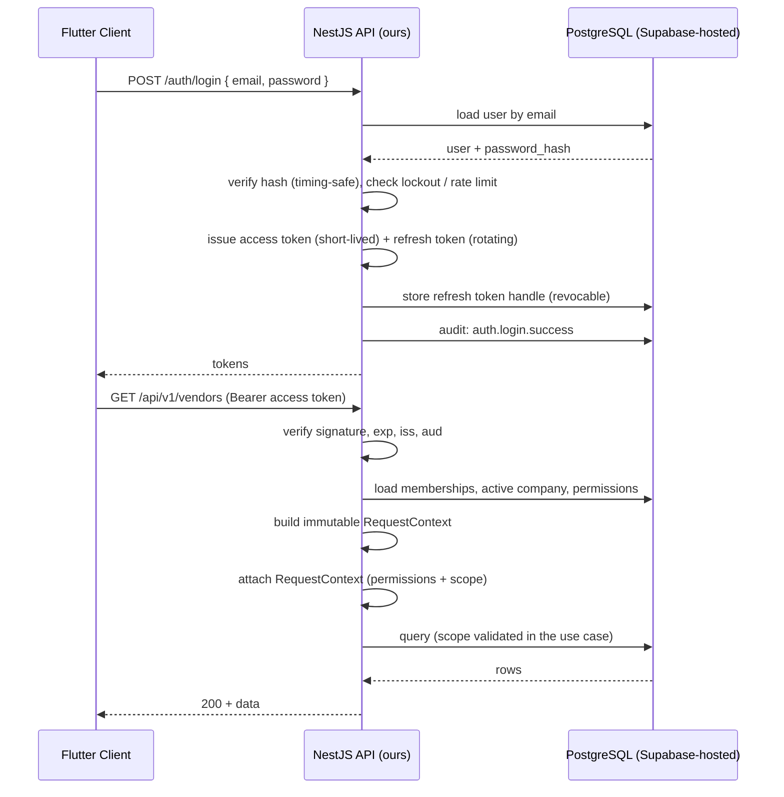
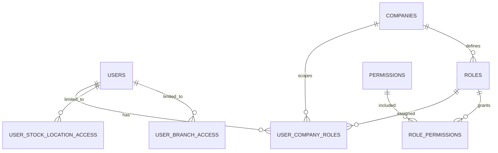

# Authentication & Authorization Architecture

**Status:** Active (Phase 0) · **Decisions:** ADR-003 (AuthN — backend-owned), ADR-004 (AuthZ — configurable RBAC)
**Related:** `SECURITY_RULES.md`, `docs/architecture/ORGANIZATION_AND_SCOPE.md`, ADR-013

---

## 1. Three Separate Questions

Freshers routinely collapse these. Do not.

| Question | Name | Failure response |
| --- | --- | --- |
| Who are you? | **Authentication** | `401` |
| Are you allowed to perform this action? | **Authorization** | `403` |
| Is this record within your branch / stock-location scope? | **Scoping** | `403` |

A valid token answers only the first question. The most common ERP security bug in the wild is an endpoint
that checks the token and forgets the permission.

---

## 2. Authentication Is Owned by Our Backend

**Approved decision (ADR-003):** authentication is implemented and owned by our **NestJS backend**.
Supabase Auth is **not** the authentication authority. Supabase/PostgreSQL is our database and
infrastructure only.

The reason is portability: the product must be movable to another database, provider or infrastructure with
minimal impact, and identity is the worst possible place to accept vendor coupling.

### What the backend owns

| Responsibility | Detail |
| --- | --- |
| User records | `users` is **our** table — one system of record |
| Password hashing | Argon2id (recommended) or bcrypt, via a **vetted library**. We never write our own cryptography |
| Login | Our endpoint, our token, signed with our key |
| Session / token handling | Access + refresh tokens, our lifetimes, our claims |
| Token validation | Our guard, on every request |
| Revocation | Server-side store, so logout genuinely invalidates |
| Auth security logic | Rate limiting, lockout, reset flows, auth event auditing |

> **"We own authentication" does not mean "we invent cryptography."** Hashing and signing use maintained
> libraries. What we own is the *flow*.

### Authentication flow



### Mandatory controls

Because we own this code, these are requirements, not suggestions (ADR-003 §Mandatory controls):

1. Argon2id/bcrypt at appropriate work factors — never MD5, never bare SHA, never hand-rolled.
2. Passwords never logged, never returned, never in an audit snapshot.
3. Short-lived access tokens; rotating, revocable refresh tokens.
4. Signing keys in the backend environment only; rotatable.
5. Rate limiting and lockout, per account **and** per source address.
6. All auth events audited — success, failure, lockout, password change, reset, revocation — **without** the
   attempted password.
7. Reset via single-use, expiring, non-guessable tokens; the flow never reveals whether an account exists.
8. Timing-safe comparison; identical response for "unknown user" and "wrong password".
9. A dedicated security test suite — this module's tests protect every other module.

### What the client never receives

Database credentials, connection strings, Supabase service-role keys, or any secret. The Flutter client holds
only its own tokens, in secure platform storage.

---

## 3. Authorization — Configurable RBAC with Granular Permissions

**Approved decision (ADR-004).** Two directions matter most:

- **No fixed or default role list.** We do **not** ship Admin, Manager, Accountant or any named role.
- **Roles and Permissions are a product feature** with full CRUD, subject to authorization.



Two points to read carefully:

1. **`roles` belongs to a company.** Roles are customer data, created by the customer, scoped by
   `company_id` like every other protected table.
2. **`user_company_roles` is what makes rights per-company.** The same person can hold different roles in
   Company A and Company B. A `role` column on `users` cannot express this — which is why the prototype's
   model is wrong by construction.

### Permissions

- Named `<module>.<action>`, **granular** — read, create, update and delete are separate grants.
- A **system-defined catalogue**: permissions are what the code enforces, so users cannot invent them.
- Extended module by module as modules are built; each module registers its own permissions.

```
vendor.view          vendor.create        vendor.update        vendor.delete
raw-material.view    raw-material.create  raw-material.update  raw-material.delete
purchase.view        purchase.create      purchase.update      purchase.approve
stock.view           stock.adjust
role.view            role.create          role.update          role.delete
user.view            user.invite          user.assign-role
company.settings.manage
```

The exact matrix is defined **per module**, documented in each module's `API_SPECIFICATION.md`. The
architecture supports custom roles and granular permissions **from the beginning** — the tables, the guard
and the CRUD exist in Phase 0 even though the catalogue grows.

### Roles — created by the customer

Each company creates the roles its own structure requires. A three-person company might create one role; a
larger one might separate purchasing, stores and accounts. We do not decide this for them.

> **Why no default role list?** The product is sold to many companies with different organisational shapes.
> A fixed list works until the second customer whose structure does not match. An **optional, clearly-labelled
> starting template** offered during company setup — which the customer may edit or ignore — is permitted and
> is *not* a fixed role list.

### Role & Permission CRUD (a Phase 0 product feature)

| Capability | Permission |
| --- | --- |
| Create a role | `role.create` |
| View roles and their permissions | `role.view` |
| Update a role (rename, change permissions) | `role.update` |
| Delete a role where allowed | `role.delete` |
| Assign permissions to a role | `role.update` |
| Assign roles to a user | `user.assign-role` |
| View the permission catalogue | `role.view` |

Rules:
- A role still assigned to users cannot be silently deleted — reassignment is explicit.
- Every role/permission change is **audited** with actor, before and after (ADR-012).
- **Lockout guard:** a company must always retain at least one user who can manage roles and users. The
  system refuses the operation that would remove the last one. *(Without this, a customer can permanently
  lock themselves out of their own system, and recovery requires manual database intervention.)*
- A company can only see and assign **its own** roles — `role.view` in Company A never returns Company B's
  roles.

### Code checks permissions, never role names

```ts
// ❌ WRONG — impossible now that roles are customer-defined
if (user.role === 'admin') { ... }

// ✅ CORRECT
@RequirePermission('purchase.approve')
```

With configurable roles, role-name checks are not merely brittle — they cannot work at all, because we do not
know what the customer named their roles.

### Deny by default

The global guard **requires** an explicit permission declaration. An endpoint with no decorator fails closed.
Genuinely public endpoints (health check, login) are marked `@Public()` and reviewed as a security change.

---

## 4. The Guard Chain

Order matters — each guard assumes the previous one succeeded:

```
1. AuthenticationGuard   → verify our token, load user               → 401
2. ScopeContextGuard     → build RequestContext (permissions + scope)  → 401/403
3. PermissionGuard       → check the required permission             → 403
4. (in the use case) resource ownership + branch/stock-location scope → 404/403
```

Step 4 cannot be a guard, because it must load the resource. It lives in the use case and repository
(`docs/architecture/ORGANIZATION_AND_SCOPE.md` §5).

---

## 5. Worked Example

`POST /api/v1/purchases` from a user of Company A whose role lacks `purchase.create`:

| Step | Result |
| --- | --- |
| 1. Token verified by our backend | ✅ user identified |
| 2. Context built | `companyId = A`, stock locations `[L1]`, permissions loaded |
| 3. Permission `purchase.create` | ❌ not held → **`403 PERMISSION_DENIED`** |

Same call from a user whose role does hold it, but targeting a vendor of Company B:

| Step | Result |
| --- | --- |
| 3. Permission | ✅ granted |
| 4a. Vendor lookup scoped to Company A | not found → **`404 NOT_FOUND`** |

The vendor exists — but saying so would confirm Company B's data to Company A. The `404` is deliberate.

And targeting a stock location outside the caller's scope but inside their own company:

| Step | Result |
| --- | --- |
| 4b. Stock location scope check | → **`403 STOCK_LOCATION_OUT_OF_SCOPE`** |

`403` here, not `404`, because the user knows the location exists within their company — they simply may not
use it.

---

## 6. Mandatory Tests

For every protected endpoint (`TESTING_RULES.md` §3.3):

```ts
it('returns 401 without a token', ...)
it('returns 401 for an expired token', ...)
it('returns 403 when the role lacks purchase.create', ...)
it('returns 404 when the vendor belongs to another company', ...)
it('returns 403 when the stock location is outside the user scope', ...)
it('ignores companyId supplied in the request body', ...)
```

For the auth module specifically:

```ts
it('never returns the password hash in any response', ...)
it('responds identically for an unknown user and a wrong password', ...)
it('locks the account after N failed attempts', ...)
it('invalidates the refresh token on logout', ...)
it('rotates the refresh token on use', ...)
```

For role management:

```ts
it('does not return roles belonging to another company', ...)
it('refuses to remove the last user who can manage roles', ...)
it('audits every permission change with actor, before and after', ...)
```

---

## 7. Current Gap

`lib/core/models/user_model.dart` today:

```dart
class UserModel {
  final String id, name, email, role, avatarUrl;   // role is a display String
}
```

There is no authentication (`login_screen.dart` is cosmetic), no permission model, no company membership.
This is existing prototype work retained per ADR-010 — it is not a defect to fix on sight, but **no new code
may follow this pattern.** Building the real model is Phase 0 tasks 6 and 7.
