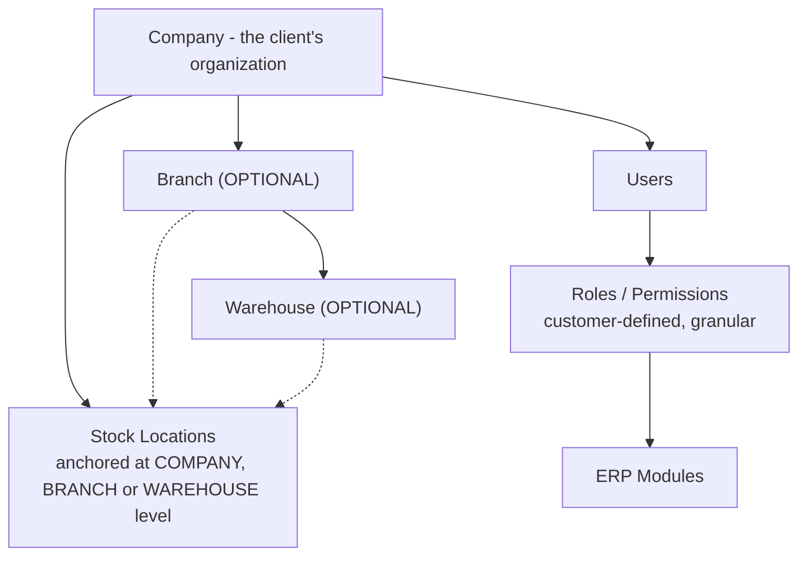

# Organization Structure, Access Control & Stock Scope

**Status:** Active (Phase 0) · **Decisions:** ADR-014 (single-client), ADR-013 (flexible stock scope),
ADR-004 (RBAC) · **Replaces:** `MULTI_TENANCY.md`
**Related:** `SECURITY_RULES.md`, `DATABASE_RULES.md`, `docs/architecture/AUTHENTICATION_AUTHORIZATION.md`

> **Read this first.** This ERP is built for **one client**, deployed as a **dedicated instance** (ADR-014).
> There is **no multi-tenancy**. "Company" here means **the client's own organization**, not a SaaS tenant.
> Isolation between clients is achieved by running **separate deployments with separate databases** — a
> stronger boundary than row-level filtering, and one that requires no application machinery.

---

## 1. The Organization Hierarchy



| Level | Meaning | Mandatory? |
| --- | --- | --- |
| **Company** | The client's organization / business entity | Always — at least one |
| **Branch** | A location of the organization | **No** (ADR-013) |
| **Warehouse** | A physical store within a branch | **No** (ADR-013) |
| **Stock Location** | Where stock actually sits; resolves to whichever level applies | Always — at least one |

**Company is an organizational master, not a security boundary.** It is not a tenant discriminator, and it
is not required on every table — only where the client's business genuinely needs organizational attribution.

> ✅ **Q-22 is closed (2026-08-29): the client has ONE legal entity.** `companies` therefore holds a single
> organizational row, `company_id` does **not** appear on documents, masters or unique constraints, and GST
> determination uses that one registered state (Gujarat). See `Client Doc/FINAL_BUSINESS_DECISIONS.md`.

---

## 2. Flexible Stock Scope (ADR-013)

The client may operate any of three structures, and the system must support all three:

```
Scenario A:  Company → Stock
Scenario B:  Company → Branch → Stock
Scenario C:  Company → Branch → Warehouse → Stock
```

Therefore **`warehouse_id` is never assumed mandatory**, and neither is `branch_id`.

### The stock location abstraction

Stock always references a **`stock_location_id`**, which is always `NOT NULL`. A stock location is anchored at
exactly one level:

```
stock_locations
  id, company_id,
  level ∈ { COMPANY, BRANCH, WAREHOUSE },
  branch_id     NULL,   -- required when level = BRANCH or WAREHOUSE
  warehouse_id  NULL,   -- required when level = WAREHOUSE
  name, is_default, is_active
```

with a check constraint enforcing that a row satisfies the level it claims.

**Why an abstraction instead of nullable columns on the ledger.** If `stock_transactions` and
`stock_balances` carried nullable `branch_id`/`warehouse_id`, the balance key
`(company_id, branch_id, warehouse_id, item_id)` would **not deduplicate** — in PostgreSQL `NULL <> NULL`, so
a Scenario-A organization's rows would all key on `(NULL, NULL)` and a plain unique constraint would permit
duplicate balance rows for one item. Confining nullability to the single, constraint-guarded
`stock_locations` table keeps every downstream key `NOT NULL` and every stock query uniform across all three
scenarios.

This reasoning is unchanged by the removal of multi-tenancy — it was never about tenancy.

### UI consequence

| Company level | What the user sees |
| --- | --- |
| `COMPANY` | **No location picker** — the single location is resolved server-side |
| `BRANCH` | Branch selector |
| `WAREHOUSE` | Branch + warehouse selector |

A single-location organization must never be shown a one-item dropdown.

---

## 3. Access Control — What Replaced Tenant Isolation

Removing multi-tenancy removed **tenant isolation**. It did **not** remove access control. Every protected
operation still verifies:

```
1. Authentication       → who is the caller?                    → 401 if unknown
2. Authorization        → does the caller hold the permission?   → 403 if not
3. Resource access      → may this user act on THIS resource?    → 403 if not
4. Branch scope         → is the branch within the user's scope? → 403 if not (where branches exist)
5. Stock location scope → is the location within scope?          → 403 if not
```

Steps 3–5 are **resource-level authorization**. They matter just as much in a single-organization system:
a store keeper in the Ahmedabad branch should not post stock movements in Mumbai, and a user without
`purchase.approve` must not approve a purchase by calling the API directly.

### Response codes

| Situation | Response |
| --- | --- |
| No / invalid / expired token | `401 UNAUTHENTICATED` |
| Missing permission | `403 PERMISSION_DENIED` |
| Resource exists but is outside the user's branch scope | `403 BRANCH_OUT_OF_SCOPE` |
| Resource exists but is outside the user's stock-location scope | `403 STOCK_LOCATION_OUT_OF_SCOPE` |
| Resource does not exist | `404 NOT_FOUND` |

> **Changed from the previous design.** Under multi-tenancy, an out-of-tenant resource returned **`404`** to
> avoid confirming that another customer's record existed. That concern no longer applies: within one
> organization, a user may legitimately know a record exists while being denied access to it. **`403` is now
> the correct answer** for an in-scope-organization resource the user may not act on, and `404` means
> genuinely not found. Cross-tenant `404` requirements have been removed from the testing rules.

---

## 4. The Trusted Request Context

Built server-side on every request from the **verified token** (ADR-003), never from request input:

```ts
export interface RequestContext {
  readonly userId: string;
  readonly branchIds: readonly string[];         // branches this user may act in
  readonly stockLocationIds: readonly string[];  // stock locations this user may act in
  readonly permissions: ReadonlySet<string>;
  readonly correlationId: string;
}
```

**Never** derived from request body, query string, path parameter or a custom header. A client may *request*
a branch or stock location — that is a legitimate UI action — but the request is **validated against the
caller's scope** before use:

```ts
if (!ctx.stockLocationIds.includes(dto.stockLocationId)) {
  throw new StockLocationOutOfScopeError(dto.stockLocationId);   // 403
}
```

Note what is **absent** compared with the superseded design: there is no `companyId` on the context as a
tenant key — and none is needed, since **Q-22 confirmed a single legal entity**. Company appears only as the
anchor of the stock hierarchy on `stock_locations`.

---

## 5. What Was Removed, and What Was Kept

| Removed (ADR-014) | Kept |
| --- | --- |
| Multi-tenant RLS policies on every table | Database constraints, FKs, check constraints (`DATABASE_RULES.md`) |
| `company_id` as a mandatory discriminator everywhere | Company/Branch/Warehouse as organizational entities |
| Tenant-scoped repositories built for SaaS isolation | Repositories that respect branch / stock-location scope |
| Composite FKs for cross-tenant safety | Composite FKs where they express a genuine business constraint |
| Cross-tenant `404` responses and tests | Resource-level `403` authorization tests |
| Transaction-local `app.current_company_id` session variable | — |
| `seedTwoCompanies()` test fixture | Fixtures seeding users with **different roles and scopes** |

The last row is the important one for testers: the security test that used to prove "Company A cannot read
Company B" is replaced by "a user without the permission, or outside the scope, is refused" — which is the
threat that actually exists in this product.

---

## 6. If SaaS Ever Returns

Retrofitting multi-tenancy would be a substantial project, not a configuration change (ADR-014 accepts this
explicitly). It would need a **new ADR** informed by real multi-client requirements.

Do **not** pre-emptively add tenant columns, tenant guards or RLS "just in case". A discriminator with no
enforcement is security theatre: it looks like isolation and provides none, and a future developer may trust
it. If the requirement returns, it will be designed properly then.
