# Stock Management, Manufacturing, Sales & Commission Management Software

> Source: `Stock_Management_Software_Documentation_without_BOM-2.pdf`
> This document is a faithful transcription of the client requirement PDF into Markdown.
> Flow diagrams from the PDF have been reproduced as Mermaid diagrams.
> Notes marked **[Doc note]** flag gaps/inconsistencies found in the original PDF — they are not requirements.

---

## 1. Project Overview

The software will manage the complete business flow from raw material purchasing to finished product sales and commission calculation.

### Main Business Flow

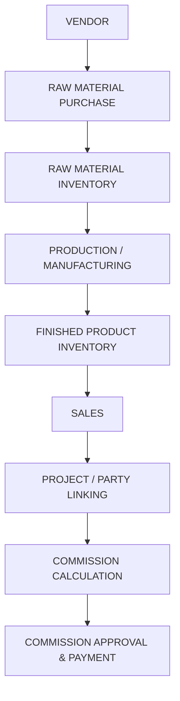

---

## 2. Main Modules

### Dashboard
- Business summary
- Sales and purchase overview
- Low stock and pending payments

### Masters
- Vendors
- Customers
- Dealers
- Architects
- Raw Materials
- Finished Products
- Unit (kg, sq feet, piece) *(example)*

### Purchase
- Purchase entry
- Purchase history
- Vendor payments
- Bill of Material

> **[Doc note]** The PDF is titled "without BOM", yet "Bill of Material" is still listed under the Purchase module. Confirm with the client whether BOM is in or out of scope.

### Production
- Production history

### Inventory
- Raw material stock
- Finished product stock
- Stock in & stock out
- Stock adjustments

### Sales
- Quotations
- Sales orders
- Invoices
- Sales returns

### Commission
- Project-based commission
- Yearly purchase-based commission
- Commission payments

### Payments
- Customer payments
- Dealer payment
- Architect payment
- Vendor payments

### Reports
- Inventory, Purchase, Production, Sales, Project, Commission and Financial reports, Quotation, Invoice

> **[Doc note]** The original PDF has no section numbered **3**; numbering jumps from 2 to 4.

---

## 4. Dashboard *(Last priority)*

**Summary cards**
- Total Sales
- Total Purchase
- Raw Material Stock Value
- Finished Product Stock Value
- Today's Sales
- Pending Customer Payments
- Pending Vendor Payments
- Pending Commission
- Low Stock Items

**Charts**
- Monthly Sales
- Monthly Purchase
- Production Overview
- Sales by Product from direct customer, Architect, Dealer

**Quick actions**
- Create Purchase
- Create Product
- Create Sale

---

## 5. Master Management

`*` = Required field

### 5.1 Vendor Management

**Fields:** Vendor Name\*, Contact Person\*, Mobile\*, Email, GST Number, PAN Number, Address\*, Payment Terms, Credit Limit

**Actions:** Add, View, Edit, Delete (Reason \*), Create Purchase, Purchase History, Payment History

### 5.2 Customer Management

**Fields:** Customer Name\*, Mobile\*, Email, GST Number, Address\*

**Actions:** Add, Edit, Create Sale, View Outstanding Amount

### 5.3 Dealer Management

**Fields:** Dealer Name\*, Contact Person\*, Mobile\*, Company Name, Email, GST Number, Address\*

**Actions:** Add, Edit, Projects, Commission

### 5.4 Architect Management

**Fields:** Architect Name\*, Company Name\*, Mobile\*, Email, GST Number, Address\*

**Actions:** Add, Edit, Projects, Commission, Related Sales

### 5.5 Raw Material Management

**Fields:** Material Name\*, Item Code\*, Unit\* (kg, sq feet, piece), Opening Stock, Minimum Stock, Reorder Level, Default Purchase Price, GST, Preferred Vendors

**Actions:** Add, Edit, View Stock, Adjust Stock, View Stock History

### 5.6 Finished Product Management

**Fields:** Product Name\*, Item Code, Unit\*, Cost Price, Dealer Selling Price, Customer Selling Price, GST, Minimum Stock

**Actions:** Add, Edit, Create, View Stock, Production History, Sales History

---

## 6. Purchase Management

### Purchase Flow

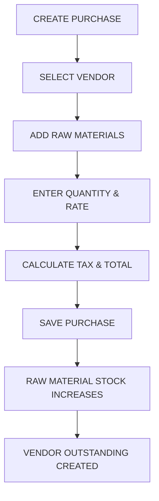

### Purchase Form Details

*(Retrieve data from image or PDF)*

- Purchase Number (Auto Generated)
- Purchase Date
- Vendor
- Vendor Invoice Number
- Invoice Date
- Line items: Raw Material, Quantity, Unit, Rate, Discount, GST, Line Total
- Total Amount, Paid Amount, Pending Amount, Payment Mode

**Buttons:** Save Draft, Save Purchase, Edit, Record Payment, Print Purchase

---

## 7. Production Management

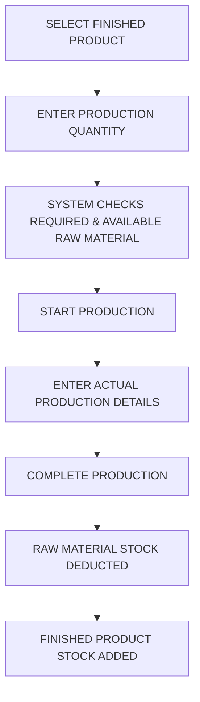

### Production Fields
- Production Number
- Finished Product
- Planned Quantity
- Actual Quantity Produced
- Actual Raw Material Used
- Other Expenses
- Production Date

### Production Costing

```
Production Cost   = Raw Material Cost + Labour Cost + Other Expenses
Cost per product  = Total Production Cost / Finished Quantity
```

---

## 8. Inventory Management

The system will manage **Raw Material Stock** and **Finished Product Stock**.

**Transaction Types:** `PURCHASE`, `PRODUCTION_CONSUMPTION`, `PRODUCTION_OUTPUT`, `SALE`, `SALE_RETURN`, `PURCHASE_RETURN`, `DAMAGE`, `ADJUSTMENT`

**Stock Movement Fields:** Date, Item, Item Type, Transaction Type, Reference Number, Stock In, Stock Out, Current Balance

### Stock Effect Matrix

| Event | Effect |
| --- | --- |
| PURCHASE | Raw Material Stock **+** |
| PRODUCTION | Raw Material Stock **−** |
| PRODUCTION | Finished Product Stock **+** |
| SALE | Finished Product Stock **−** |
| RETURN | Finished Product Stock **+** |

> **[Doc note]** The original PDF has no section numbered **9**.

---

## 10. Sales Management

Products can be sold to **Customers** or **Dealers**. **Architects** can be linked to a sale or project for commission purposes.

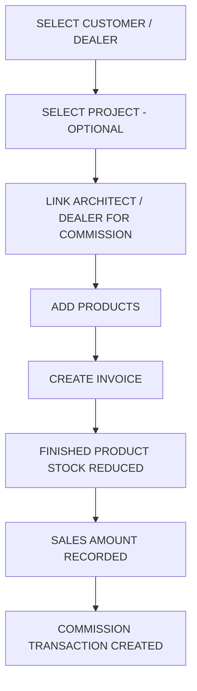

**Invoice fields:** Party Type, Customer/Dealer, Project, Architect/Dealer Commission Parties, Products, Quantity, Rate, Discount, GST, Paid Amount, Payment Mode

**Buttons:** Save Draft, Create Invoice

---

## 11. Project Management

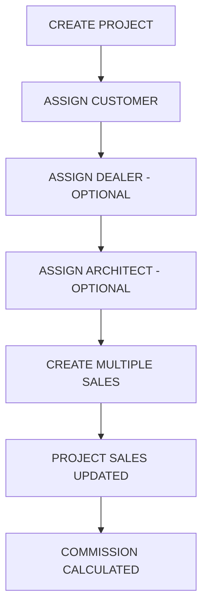

### Project Fields
- Project Name
- Customer / Dealer / Architect
- Start Date
- Expected Completion Date
- Project Status

**Project Status values:** Planned, Active, Completed, Closed

---

## 12. Commission Management

The system supports two main commission methods: **Project-Based Commission** and **Yearly Purchase-Based Commission**.

### 12.1 Project-Based Commission

Commission is calculated based on sales linked to a specific project.

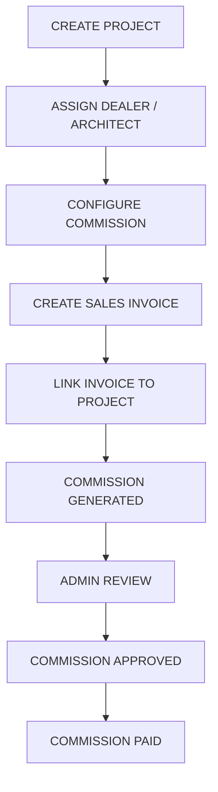

### 12.2 Yearly Purchase-Based Commission

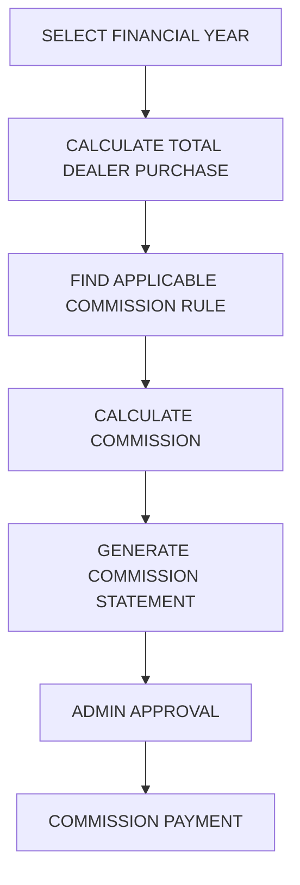

#### Example Commission Slabs

| Yearly Purchase | Commission |
| --- | --- |
| 0 – 5 Lakh | 1% |
| 5 – 10 Lakh | 2% |
| 10 – 25 Lakh | 3% |
| Above 25 Lakh | 5% |

> **[Doc note]** The original PDF has no sections numbered **13** or **14**.

---

## 15. Payments Management

### Customer Payments

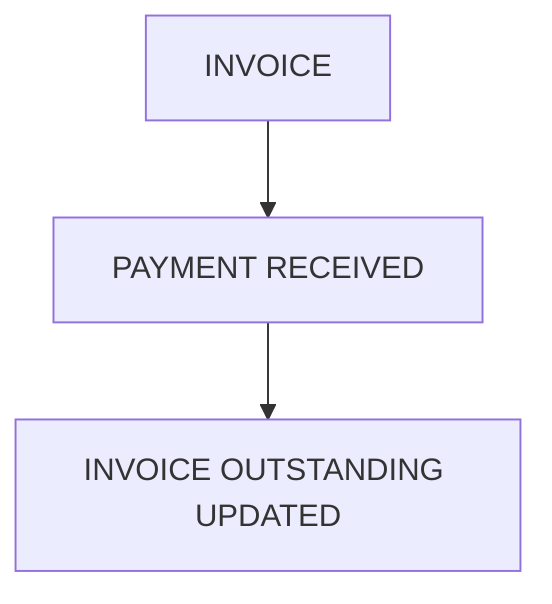

### Vendor Payments

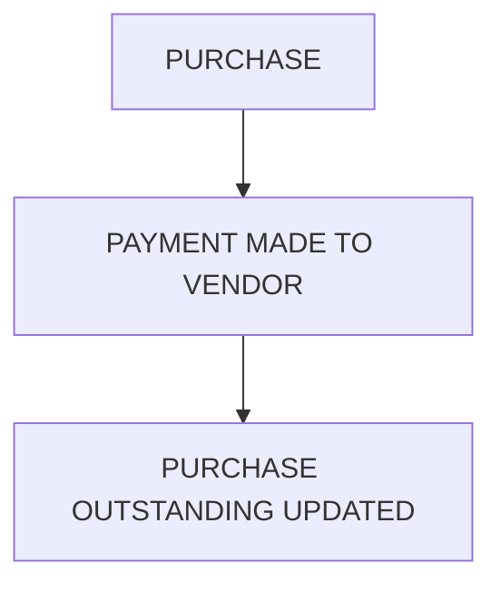

### Commission Payments

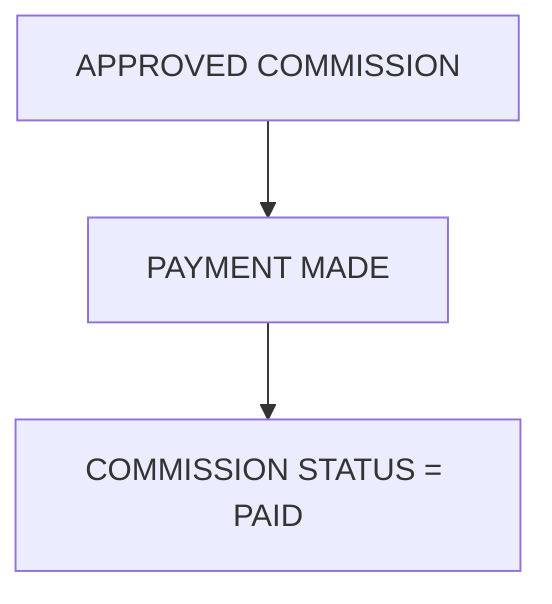

---

## 16. Reports *(Last priority)*

### Inventory Reports
- Raw Material Stock Report
- Finished Product Stock Report
- Low Stock Report
- Stock Movement Report
- Stock Valuation Report

### Purchase Reports
- Purchase Report
- Vendor-wise Purchase
- Material-wise Purchase
- Purchase Return Report
- Vendor Outstanding Report

### Production Reports
- Production Report
- Raw Material Consumption
- Wastage Report
- Production Cost Report

### Sales Reports
- Sales Report
- Product-wise Sales
- Customer-wise Sales
- Dealer-wise Sales
- Sales Return Report

### Project Reports
- Project Sales Report
- Project Status Report
- Project-wise Commission Report

### Commission Reports
- Pending Commission
- Approved Commission
- Paid Commission
- Dealer Commission
- Architect Commission
- Yearly Commission Statement

### Financial Reports
- Customer Outstanding
- Vendor Outstanding
- Commission Payable

---

## 17. Complete Screen Order

1. Login
2. Dashboard
3. Masters – Categories & Units
4. Vendors
5. Customers
6. Dealers
7. Architects
8. Raw Materials
9. Finished Products
10. *(blank in source document)*
11. Purchase List
12. Create Purchase
13. Vendor Payment
14. Production Order List
15. Create Production
16. Complete Production
17. Inventory Dashboard
18. Stock Movement
19. Sales Invoice List
20. Create Sale
21. Project List
22. Create Project
23. Project Details
24. Payment Dashboard *(numbered 30 in source)*
25. Reports *(numbered 31 in source)*
26. Settings *(numbered 32 in source)*

> **[Doc note]** Item 10 is empty in the source and the numbering jumps from 23 to 30. Confirm the missing screens with the client.

---

## 18. Complete System Flow

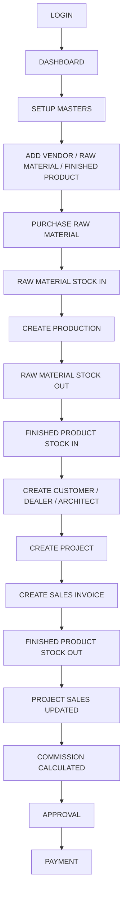

---

## 19. Recommended Database Entities

- `users`
- `vendors`
- `customers`
- `dealers`
- `architects`
- `units`
- `raw_materials`
- `finished_products`
- `purchases`
- `purchase_items`
- `purchase_payments`
- `production_orders`
- `production_materials`
- `production_outputs`
- `stock_transactions`
- `projects`
- `project_parties`
- `sales_invoices`
- `sales_invoice_items`
- `sales_payments`

---

## 20. Recommended Development Phases

### Phase 1 – Core Masters & Inventory
- Dashboard
- Vendors
- Raw Materials
- Finished Products
- Purchase
- Inventory

### Phase 2 – Manufacturing
- Production
- Raw Material Consumption
- Finished Product Output
- Production Cost

### Phase 3 – Sales & Projects
- Customers
- Dealers
- Architects
- Projects
- Sales Invoices
- Payments

### Phase 4 – Commission
- Commission Rules
- Project-Based Commission
- Yearly Purchase Commission
- Commission Approval
- Commission Payment

### Phase 5 – Final Features
- Reports
- Dashboard Analytics
- User Roles & Permissions
- Settings
- Notifications
- Export PDF/Excel

---

## 21. Important Business Rule

The system should maintain **every stock movement as a stock transaction** instead of only storing the current stock quantity. This is necessary for accurate stock calculation, audit history and reporting.

Example ledger:

| Movement | Quantity | Item Type |
| --- | --- | --- |
| Purchase | +100 | Raw Material |
| Production Consumption | −20 | Raw Material |
| Production Output | +10 | Finished Product |
| Sale | −2 | Finished Product |
| Sale Return | +1 | Finished Product |

---

## 22. Final Core Flow

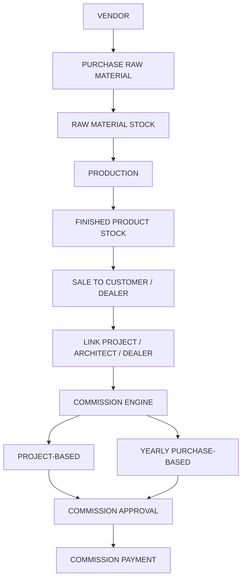

---

## Open Questions for the Client

These follow from the **[Doc note]** items above and should be resolved before implementation:

1. Is **Bill of Material** in scope? The document title says "without BOM" but BOM is listed under the Purchase module.
2. Sections **3, 9, 13 and 14** are missing from the source document — was content intended there (e.g. user roles, quotations/sales orders detail, settings)?
3. Screen order item **10** is blank and the list jumps from 23 to 30 — which screens are missing?
4. The Sales module lists **Quotations** and **Sales Orders**, but the document contains no field-level detail or flow for them.
5. **Purchase Return**, **Damage** and **Adjustment** appear as stock transaction types but have no corresponding screens or flows defined.
6. Commission slabs (1% / 2% / 3% / 5%) are marked "Example" — confirm whether slabs are configurable per dealer or fixed system-wide.
7. **Labour Cost** appears in the production cost formula but not in the Production Fields list.
