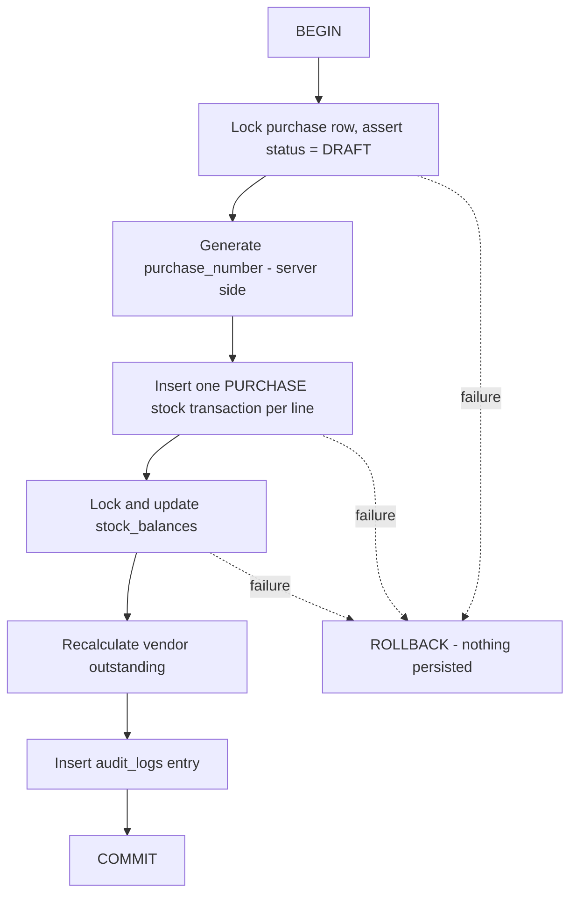

# Stock Management — API Specification (Phase 1)

**Status:** Active — Q-03, Q-05, Q-05a, Q-15, Q-19 and Q-22 all closed. Contract is settled.
**Base:** `/api/v1` · **Conventions:** `API_CONVENTIONS.md` (envelope, errors, pagination, string money)

> Every endpoint below assumes: authentication required, permission required, Company scope from the token,
> money and quantity as **strings**, and the standard `{ data, meta }` / `{ error }` envelope.

---

## 1. Endpoint Summary

| Method | Path | Permission | Phase |
| --- | --- | --- | --- |
| GET | `/vendors` | `vendor.view` | 1 |
| POST | `/vendors` | `vendor.create` | 1 |
| GET | `/vendors/{id}` | `vendor.view` | 1 |
| PATCH | `/vendors/{id}` | `vendor.update` | 1 |
| DELETE | `/vendors/{id}` | `vendor.delete` | 1 |
| GET | `/vendors/{id}/purchases` | `purchase.view` | 1 |
| GET | `/vendors/{id}/payments` | `purchase.view` | 1 |
| GET/POST | `/units` | `unit.view` / `unit.create` | 1 |
| GET/POST | `/raw-materials` | `raw-material.view` / `.create` | 1 |
| GET/PATCH | `/raw-materials/{id}` | `raw-material.view` / `.update` | 1 |
| GET | `/raw-materials/{id}/stock` | `stock.view` | 1 |
| GET | `/raw-materials/{id}/stock-history` | `stock.view` | 1 |
| GET/POST | `/finished-products` | `finished-product.view` / `.create` | 1 |
| GET | `/purchases` | `purchase.view` | 1 |
| POST | `/purchases` | `purchase.create` | 1 |
| GET | `/purchases/{id}` | `purchase.view` | 1 |
| PATCH | `/purchases/{id}` | `purchase.update` | 1 (drafts only — Q-12) |
| POST | `/purchases/{id}/confirmation` | `purchase.create` | 1 |
| POST | `/purchases/{id}/payments` | `payment.create` | 1 |
| GET | `/stock-transactions` | `stock.view` | 1 |
| GET | `/stock-balances` | `stock.view` | 1 |
| POST | `/stock-adjustments` | `stock.adjust` | 1 |
| GET | `/stock-balances/low` | `stock.view` | 1 |

**No endpoint accepts a permission or scope claim.** Permissions and scope come from the verified token (`SECURITY_RULES.md` §3). A `stockLocationId` may be *requested* but is validated against the caller scope.

---

## 2. `POST /vendors`

| | |
| --- | --- |
| **Auth** | Required |
| **Permission** | `vendor.create` |
| **Scope** | Permission only — vendors are organization-wide |

**Request**

```json
{
  "name": "Apex Aluminum Extrusions Ltd",
  "contactPerson": "Vikram Mehta",
  "mobile": "+91 98201 44521",
  "email": "sales@apexaluminum.in",
  "gstNumber": "27AAACA1234F1Z5",
  "panNumber": "AAACA1234F",
  "address": "Plot 42, GIDC Industrial Estate, Surat, Gujarat",
  "paymentTerms": "Net 30 Days",
  "creditLimit": "500000.00"
}
```

**Validation:** `name`, `contactPerson`, `mobile`, `address` required (BR-VEN-001); `email` valid if present;
`creditLimit` decimal ≥ 0.

**Success `201`** — the vendor with `id`, `createdAt`, and `outstandingBalance: "0.00"` (derived).

**Errors:** `401 UNAUTHENTICATED` · `403 PERMISSION_DENIED` · `422 VALIDATION_FAILED`

---

## 3. `DELETE /vendors/{id}` — reason is mandatory

The source document specifies `Delete(Reason *)`. A body on `DELETE` is unusual, so the reason is carried
explicitly:

**Request**

```json
{ "reason": "Vendor no longer operating - confirmed by procurement" }
```

**Behaviour:** soft delete (BR-VEN-003). Sets `is_deleted`, `deleted_at`, `deleted_by`, `delete_reason`, and
writes an audit entry in the same transaction.

**Errors:** `422 VALIDATION_FAILED` when the reason is missing · `404 NOT_FOUND` when the vendor belongs to
a rule blocks deletion · `404 NOT_FOUND` when the vendor does not exist.

---

## 4. `GET /raw-materials`

```
GET /raw-materials?page=1&pageSize=25&sort=name&search=aluminium&lowStockOnly=true&stockLocationId=<uuid>
```

| Param | Notes |
| --- | --- |
| `page`, `pageSize` | pageSize max 100 |
| `sort` | whitelisted: `name`, `itemCode`, `createdAt` (prefix `-` for descending) |
| `search` | matches `name` and `itemCode` |
| `lowStockOnly` | balance < minimumStock (BR-RM-005) |
| `stockLocationId` | must be within the caller's scope, else `403 STOCK_LOCATION_OUT_OF_SCOPE` |

**Response**

```json
{
  "data": [
    {
      "id": "5a2f...",
      "name": "Aluminium Profile 40x40",
      "itemCode": "RM-1001",
      "unit": { "id": "u1...", "symbol": "KG" },
      "minimumStock": "50.0000",
      "reorderLevel": "75.0000",
      "defaultPurchasePrice": "245.50",
      "gstPercent": "18.0000",
      "currentStock": "150.0000",
      "isLowStock": false
    }
  ],
  "meta": { "correlationId": "...", "pagination": { "page": 1, "pageSize": 25, "totalItems": 42, "totalPages": 2 } }
}
```

`currentStock` comes from `stock_balances`; it is a **cache of the ledger**, never an editable field.

---

## 5. `POST /purchases` (creates a DRAFT)

| | |
| --- | --- |
| **Permission** | `purchase.create` |
| **Scope** | Company (token) + `stockLocationId` validated against the caller scope; optional when the company has one location (ADR-013) |
| **Idempotency** | `Idempotency-Key` recommended |

**Request**

```json
{
  "vendorId": "8f14e45f-...",
  "branchId": "2c1a...",
  "stockLocationId": "9d3b...",
  "purchaseDate": "2026-08-28",
  "vendorInvoiceNumber": "APX/2026/1187",
  "invoiceDate": "2026-08-27",
  "items": [
    {
      "rawMaterialId": "5a2f...",
      "quantity": "150.0000",
      "unitId": "u1...",
      "rate": "245.50",
      "discountAmount": "614.00",
      "gstPercent": "18.0"
    }
  ]
}
```

**Absent by design:** `companyId`, `purchaseNumber`, `lineTotal`, `totalAmount`. All are server-derived
(BR-PUR-001, BR-PUR-011).

**Behaviour:** creates the purchase with `status: "DRAFT"`. **No stock transactions, no vendor outstanding**
(BR-PUR-006).

**Errors:** `404 NOT_FOUND` (unknown vendor or material) · `403 STOCK_LOCATION_OUT_OF_SCOPE` ·
`422 VALIDATION_FAILED` (empty items, quantity ≤ 0) · `409 DUPLICATE_RESOURCE` (repeat vendor invoice number)

> **Calculation is client-confirmed (ADR-015).** Line and document totals follow
> `Gross → Discount → Taxable → GST → Round Off → Grand Total`, with **discount applied before GST** and the
> GST type (CGST+SGST vs IGST) derived from the place of supply. Only the exact round-off **direction** is
> **Round-off is an entered signed amount** (Q-05a closed) — see `Client Doc/046 Hotel Winsome, Ahmedabad.pdf`.

---

## 6. `POST /purchases/{id}/confirmation` — the critical endpoint

| | |
| --- | --- |
| **Permission** | `purchase.create` |
| **Idempotency** | **`Idempotency-Key` required** |

Transitions `DRAFT → CONFIRMED`. In **one database transaction** (BR-PUR-008):



**Success `200`**

```json
{
  "data": {
    "id": "c4d5...",
    "purchaseNumber": "PUR-2026-0105",
    "status": "CONFIRMED",
    "grossAmount": "36825.00",
    "discountAmount": "614.00",
    "taxableAmount": "36211.00",
    "cgstAmount": "3258.99",
    "sgstAmount": "3258.99",
    "igstAmount": "0.00",
    "roundOffAmount": "-0.02",
    "grandTotal": "42728.96",
    "paidAmount": "0.00",
    "pendingAmount": "42728.96",
    "stockTransactionIds": ["e1f2...", "e1f3..."]
  },
  "meta": { "correlationId": "..." }
}
```

> **Reading the amounts (ADR-015):** `taxableAmount` = `grossAmount − discountAmount` — **discount before
> GST**. This example is intra-state (within Gujarat), so CGST and SGST are populated and `igstAmount` is
> `"0.00"`; an inter-state purchase would be the reverse. `roundOffAmount` is a **separate field** and is
> never folded into the line or tax amounts. The exact round-off value shown here is illustrative — the
> value shown is illustrative; the real client example is −₹93.50 → a ₹1,00,000.00 total (ADR-015 §3).

**Errors:** `409 INVALID_STATE_TRANSITION` (already confirmed or cancelled) · `422 BUSINESS_RULE_VIOLATION`
(soft-deleted material on a line; credit limit exceeded — pending **Q-13**)

---

## 7. `POST /stock-adjustments`

| | |
| --- | --- |
| **Permission** | `stock.adjust` |
| **Idempotency** | Required |

```json
{
  "itemType": "RAW_MATERIAL",
  "itemId": "5a2f...",
  "stockLocationId": "9d3b...",
  "direction": "OUT",
  "quantity": "5.0000",
  "reason": "Damaged during handling - store manager verified"
}
```

**Validation:** `reason` is **mandatory** (BR-ADJ-001); `quantity` > 0; resulting balance may not go below
zero (BR-ADJ-004).

**Behaviour:** writes one `ADJUSTMENT` stock transaction, updates the balance under lock, writes an audit
entry with before/after balance — one transaction.

**Errors:** `422 VALIDATION_FAILED` (missing reason) · `422 INSUFFICIENT_STOCK` (would go negative) ·
`403 STOCK_LOCATION_OUT_OF_SCOPE`

> ⚠️ **Blocked on Q-11:** whether adjustments require approval, and which roles hold `stock.adjust`.

---

## 8. `GET /stock-transactions` — the ledger view

```
GET /stock-transactions?itemId=<uuid>&itemType=RAW_MATERIAL&stockLocationId=<uuid>
    &transactionType=PURCHASE&dateFrom=2026-04-01&dateTo=2026-08-28&page=1&pageSize=50
```

```json
{
  "data": [
    {
      "id": "e1f2...",
      "occurredAt": "2026-08-28T10:15:00.000Z",
      "itemType": "RAW_MATERIAL",
      "item": { "id": "5a2f...", "name": "Aluminium Profile 40x40", "itemCode": "RM-1001" },
      "warehouse": { "id": "9d3b...", "name": "Warehouse A" },
      "transactionType": "PURCHASE",
      "referenceType": "PURCHASE",
      "referenceId": "c4d5...",
      "referenceNumber": "PUR-2026-0105",
      "quantityIn": "150.0000",
      "quantityOut": "0.0000",
      "runningBalance": "150.0000",
      "reason": null,
      "performedBy": { "id": "u9...", "name": "Alex Sterling" }
    }
  ],
  "meta": { "pagination": { "...": "..." } }
}
```

`runningBalance` is **computed by the query** (window function), not stored per row — see
`DATABASE_DESIGN.md` §10.

**There is no `POST`, `PATCH` or `DELETE` on `/stock-transactions`.** The ledger is append-only and is
written only as a side effect of a business document (ADR-005). This absence is deliberate; do not add them.

---

## 9. Common Error Responses

Every endpoint can return:

| Status | Code | When |
| --- | --- | --- |
| 401 | `UNAUTHENTICATED` | Missing/invalid/expired token |
| 403 | `PERMISSION_DENIED` | Role lacks the permission |
| 403 | `BRANCH_OUT_OF_SCOPE` / `STOCK_LOCATION_OUT_OF_SCOPE` | Outside the caller's assigned scope |
| 404 | `NOT_FOUND` | Not found **or** belongs to another Company |
| 409 | `DUPLICATE_RESOURCE` | Unique constraint violated |
| 409 | `INVALID_STATE_TRANSITION` | e.g. confirming an already-confirmed purchase |
| 422 | `VALIDATION_FAILED` | DTO validation |
| 422 | `BUSINESS_RULE_VIOLATION` | Domain rule violated |
| 422 | `INSUFFICIENT_STOCK` | Movement would take stock below zero |
| 500 | `INTERNAL_ERROR` | Unexpected — logged, no detail returned |

---

## 10. Definition-of-Complete for Each Endpoint

Per `API_CONVENTIONS.md` §1, an endpoint is complete only when all twelve items are specified **and** the
test scenarios in `TEST_CASES.md` pass — including the mandatory 401 / 403-permission / 403-out-of-scope trio.
