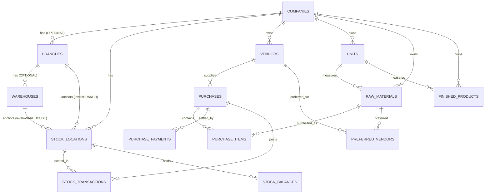

# Stock Management — Database Design (Phase 1)

**Status:** Active — **schema unblocked**. Q-03, Q-05, Q-05a, Q-15, Q-19 and Q-22 all closed.
**Related:** `DATABASE_RULES.md`, ADR-005, ADR-011, ADR-012, **ADR-013**, **ADR-014**, **ADR-015**,
`Client Doc/FINAL_BUSINESS_DECISIONS.md`

> **Revision 2026-08-29.**
> - **ADR-014:** multi-tenancy withdrawn. `company_id` is **not** a tenant discriminator and is **not** on
>   every table. It appears only on `stock_locations`, as the organizational owner. **No RLS policies.**
> - **ADR-013:** branches and warehouses are optional; stock references `stock_location_id`.
> - **ADR-015:** discount/GST/round-off rules **confirmed** — tax and round-off columns are now specified
>   (§7). The schema is no longer blocked.

> This is a design, not a migration. Every table below assumes the mandatory audit columns and constraints
> defined in `DATABASE_RULES.md` §3, §4.1 and §5.

---

## 1. Entity Relationship Overview



The source document's §19 entity list is honoured. `stock_balances` and `preferred_vendors` are additions
required by ADR-005 and by the "Preferred Vendors" field in §5.5. `stock_locations` is required by ADR-013.

**Read the diagram carefully:** `BRANCHES` and `WAREHOUSES` are marked OPTIONAL. A `COMPANY`-level customer
has neither — but still has exactly one `STOCK_LOCATION`, so the ledger below never needs a nullable key.

---

## 2. Foundation Tables (Phase 0)

Created by the Phase 0 foundation, listed here for context:

`companies` · `branches` *(optional per company)* · `warehouses` *(optional per company)* ·
**`stock_locations`** · `users` *(with `password_hash` — ADR-003)* · `refresh_tokens` · `roles`
*(customer-defined, company-scoped — ADR-004)* · `permissions` · `role_permissions` · `user_company_roles` ·
`user_branch_access` · `user_stock_location_access` · `audit_logs`

### 2.1 `companies.stock_scope_level` (ADR-013)

```sql
CREATE TYPE stock_scope_level AS ENUM ('COMPANY', 'BRANCH', 'WAREHOUSE');

ALTER TABLE companies
  ADD COLUMN stock_scope_level stock_scope_level NOT NULL DEFAULT 'COMPANY';
```

Declared at company setup. Determines which stock locations may exist and what the UI asks the user to
choose. **Changing it after stock exists is a controlled migration, not a settings toggle** — see Q-21.

### 2.2 `stock_locations` (ADR-013)

```sql
CREATE TABLE stock_locations (
  id           uuid PRIMARY KEY DEFAULT gen_random_uuid(),
  company_id   uuid NOT NULL REFERENCES companies(id),
  level        stock_scope_level NOT NULL,
  branch_id    uuid NULL,       -- required when level = BRANCH or WAREHOUSE
  warehouse_id uuid NULL,       -- required when level = WAREHOUSE
  name         text NOT NULL,
  is_default   boolean NOT NULL DEFAULT false,
  is_active    boolean NOT NULL DEFAULT true,
  -- audit columns

  CONSTRAINT ck_stock_locations__level_consistency CHECK (
    (level = 'COMPANY'   AND branch_id IS NULL     AND warehouse_id IS NULL) OR
    (level = 'BRANCH'    AND branch_id IS NOT NULL AND warehouse_id IS NULL) OR
    (level = 'WAREHOUSE' AND branch_id IS NOT NULL AND warehouse_id IS NOT NULL)
  ),
  CONSTRAINT fk_stock_locations__branches    FOREIGN KEY (branch_id)    REFERENCES branches (id),
  CONSTRAINT fk_stock_locations__warehouses  FOREIGN KEY (warehouse_id) REFERENCES warehouses (id)
);

-- exactly one default per company
CREATE UNIQUE INDEX uq_stock_locations__one_default
  ON stock_locations (company_id) WHERE is_default = true;
```

**This is the only table in the stock design with nullable location columns**, and a check constraint governs
them. Everything downstream — the ledger, the balances — uses `stock_location_id NOT NULL`. That confinement
is the entire point of ADR-013: it keeps `NULL <> NULL` out of the balance key, where it would silently allow
duplicate balance rows.

Every company gets a default stock location at setup. **A company with zero stock locations is an invalid
state and must be unreachable.**

---

## 3. `units`

```sql
CREATE TABLE units (
  id          uuid PRIMARY KEY DEFAULT gen_random_uuid(),
  name        text NOT NULL,                    -- 'Kilograms'
  symbol      text NOT NULL,                    -- 'KG'
  is_active   boolean NOT NULL DEFAULT true,
  -- audit columns per DATABASE_RULES.md §3
  CONSTRAINT uq_units__symbol UNIQUE (symbol)
);
```

Units are **deactivated**, never deleted, once referenced (ADR-012).

> **Unit Master is client-confirmed (Q-15).** `units` is a first-class master with its own CRUD. Each Raw
> Material and Finished Product references **exactly one** unit. **There is no unit conversion** — no
> conversion factors, no base unit, no dual-quantity columns on the ledger. A ledger quantity is therefore
> always expressed in the item own unit, which matters because the ledger is append-only (ADR-005) and
> cannot be reinterpreted retroactively. Units seen so far: `kg`, `sq feet`, `piece` (source document) and
> `No` (client sample invoice).

---

## 4. `vendors`

```sql
CREATE TABLE vendors (
  id             uuid PRIMARY KEY DEFAULT gen_random_uuid(),
  name           text NOT NULL,                 -- required per §5.1
  contact_person text NOT NULL,                 -- required
  mobile         text NOT NULL,                 -- required
  email          text NULL,
  gst_number     text NULL,
  pan_number     text NULL,
  address        text NOT NULL,                 -- required
  payment_terms  text NULL,
  credit_limit   numeric(18,2) NULL,            -- money: never float (ADR-011)

  is_deleted     boolean NOT NULL DEFAULT false,
  deleted_at     timestamptz NULL,
  deleted_by     uuid NULL REFERENCES users(id),
  delete_reason  text NULL,
  -- audit columns

  CONSTRAINT ck_vendors__delete_reason
    CHECK (is_deleted = false OR delete_reason IS NOT NULL),   -- enforces §5.1 "Delete (Reason *)"
  CONSTRAINT ck_vendors__credit_limit CHECK (credit_limit IS NULL OR credit_limit >= 0)
);

CREATE INDEX idx_vendors__name ON vendors (name) WHERE is_deleted = false;
```

**Note:** there is **no** `outstanding_balance` column. Outstanding is derived (BR-VEN-006). The prototype
stores it, which allows it to drift from the underlying documents.

---

## 5. `raw_materials`

```sql
CREATE TABLE raw_materials (
  id                    uuid PRIMARY KEY DEFAULT gen_random_uuid(),
  name                  text NOT NULL,
  item_code             text NOT NULL,
  unit_id               uuid NOT NULL,
  minimum_stock         numeric(18,4) NULL,
  reorder_level         numeric(18,4) NULL,     -- distinct from minimum_stock (BR-RM-004)
  default_purchase_price numeric(18,2) NULL,
  gst_percent           numeric(9,4) NULL,

  is_deleted            boolean NOT NULL DEFAULT false,
  deleted_at timestamptz NULL, deleted_by uuid NULL, delete_reason text NULL,
  -- audit columns

  CONSTRAINT uq_raw_materials__item_code UNIQUE (item_code),   -- reuse after delete: Q-06
  CONSTRAINT fk_raw_materials__units
    FOREIGN KEY (unit_id) REFERENCES units (id),
  CONSTRAINT ck_raw_materials__minimum_stock CHECK (minimum_stock IS NULL OR minimum_stock >= 0),
  CONSTRAINT ck_raw_materials__delete_reason
    CHECK (is_deleted = false OR delete_reason IS NOT NULL)
);
```

**No `opening_stock` column, and no `current_stock` column.** Opening stock is posted as an `ADJUSTMENT`
ledger entry (BR-RM-003); current stock lives in `stock_balances` as a cache (ADR-005).

### `preferred_vendors`

```sql
CREATE TABLE preferred_vendors (
  raw_material_id uuid NOT NULL REFERENCES raw_materials (id),
  vendor_id       uuid NOT NULL REFERENCES vendors (id),
  PRIMARY KEY (raw_material_id, vendor_id)
);
```

---

## 6. `finished_products`

Same shape as `raw_materials`, plus the three prices from §5.6:

```sql
  cost_price             numeric(18,2) NULL,
  dealer_selling_price   numeric(18,2) NULL,
  customer_selling_price numeric(18,2) NULL,
```

`item_code` is nullable pending **Q-06 / open** — the source document does not mark it required.

---

## 7. `purchases`

```sql
CREATE TABLE purchases (
  id                    uuid PRIMARY KEY DEFAULT gen_random_uuid(),
  branch_id             uuid NULL,               -- only when the organization uses branches
  stock_location_id     uuid NOT NULL REFERENCES stock_locations (id),   -- ADR-013
  vendor_id             uuid NOT NULL REFERENCES vendors (id),

  purchase_number       text NOT NULL,           -- server-generated (BR-PUR-001)
  purchase_date         date NOT NULL,
  vendor_invoice_number text NULL,
  invoice_date          date NULL,

  status                text NOT NULL DEFAULT 'DRAFT',   -- DRAFT | CONFIRMED | CANCELLED

  -- ADR-015 calculation chain: gross -> discount -> taxable -> GST -> round off -> grand total
  gross_amount          numeric(18,2) NOT NULL DEFAULT 0,
  discount_amount       numeric(18,2) NOT NULL DEFAULT 0,
  taxable_amount        numeric(18,2) NOT NULL DEFAULT 0,   -- the GST base
  cgst_amount           numeric(18,2) NOT NULL DEFAULT 0,   -- intra-state (within Gujarat)
  sgst_amount           numeric(18,2) NOT NULL DEFAULT 0,   -- intra-state (within Gujarat)
  igst_amount           numeric(18,2) NOT NULL DEFAULT 0,   -- inter-state (outside Gujarat)
  round_off_amount      numeric(18,2) NOT NULL DEFAULT 0,   -- ENTERED, signed; never auto-ROUND(). ADR-015 §3
  grand_total           numeric(18,2) NOT NULL DEFAULT 0,

  place_of_supply_state text NULL,               -- counterparty state; drives the GST determination
  paid_amount           numeric(18,2) NOT NULL DEFAULT 0,
  payment_mode          text NULL,
  -- audit columns

  CONSTRAINT uq_purchases__number UNIQUE (purchase_number),
  CONSTRAINT uq_purchases__vendor_invoice
    UNIQUE (vendor_id, vendor_invoice_number),   -- BR-PUR-012, duplicate-bill protection
  CONSTRAINT ck_purchases__status CHECK (status IN ('DRAFT','CONFIRMED','CANCELLED')),
  CONSTRAINT ck_purchases__amounts CHECK (
    gross_amount >= 0 AND discount_amount >= 0 AND taxable_amount >= 0 AND paid_amount >= 0),
  -- intra-state and inter-state are mutually exclusive (ADR-015 §2)
  CONSTRAINT ck_purchases__gst_exclusive CHECK (
    (igst_amount = 0) OR (cgst_amount = 0 AND sgst_amount = 0))
);
```

`pending_amount` is **not stored** — it is `grand_total − paid_amount` (BR-PUR-010), derived so it cannot
drift. `taxable_amount` is likewise the GST base and must equal `gross_amount − discount_amount`
(ADR-015 §1 — **discount before GST**).

> **`round_off_amount` is an input, not a computation.** `grand_total = taxable_amount + cgst + sgst + igst +
> round_off_amount`. It must **not** be derived with `ROUND()`: the client sample invoice
> (`Client Doc/046 Hotel Winsome, Ahmedabad.pdf`) shows a round-off of **−₹93.50** taking ₹1,00,093.50 to a
> negotiated ₹1,00,000.00 — a nearest-rupee rule would have produced −₹0.50 and could not reproduce that
> document. See ADR-015 §3 and BR-CALC-023.

### `purchase_items`

```sql
CREATE TABLE purchase_items (
  id               uuid PRIMARY KEY DEFAULT gen_random_uuid(),
  purchase_id      uuid NOT NULL REFERENCES purchases (id),
  raw_material_id  uuid NOT NULL REFERENCES raw_materials (id),
  quantity         numeric(18,4) NOT NULL,
  unit_id          uuid NOT NULL REFERENCES units (id),
  rate             numeric(18,2) NOT NULL,

  gross_amount     numeric(18,2) NOT NULL,              -- quantity x rate
  discount_amount  numeric(18,2) NOT NULL DEFAULT 0,
  taxable_amount   numeric(18,2) NOT NULL,              -- gross - discount; the GST base
  gst_percent      numeric(9,4)  NOT NULL DEFAULT 0,
  cgst_amount      numeric(18,2) NOT NULL DEFAULT 0,
  sgst_amount      numeric(18,2) NOT NULL DEFAULT 0,
  igst_amount      numeric(18,2) NOT NULL DEFAULT 0,
  line_total       numeric(18,2) NOT NULL,              -- taxable + tax

  CONSTRAINT ck_purchase_items__quantity CHECK (quantity > 0),
  CONSTRAINT ck_purchase_items__rate     CHECK (rate >= 0),
  CONSTRAINT ck_purchase_items__gst_exclusive CHECK (
    (igst_amount = 0) OR (cgst_amount = 0 AND sgst_amount = 0))
);
```

> **Discount is stored as an amount, not only a percentage.** ADR-015 states the rule in rupees
> (₹1,000 − ₹100 = ₹900). A percentage may be captured in the UI, but the **resolved amount** is what is
> stored and what the tax is computed from — so a historical document never re-derives differently.

### `purchase_payments`

```sql
CREATE TABLE purchase_payments (
  id           uuid PRIMARY KEY DEFAULT gen_random_uuid(),
  purchase_id  uuid NOT NULL REFERENCES purchases (id),
  amount       numeric(18,2) NOT NULL,
  payment_date date NOT NULL,
  payment_mode text NOT NULL,
  reference    text NULL,
  notes        text NULL,
  CONSTRAINT ck_purchase_payments__amount CHECK (amount > 0)
);
```
```

Payments are never deleted (BR-PAY-005).

---

## 8. `stock_transactions` — the ledger

**The most important table in the system.** Append-only (ADR-005).

```sql
CREATE TYPE stock_transaction_type AS ENUM (
  'PURCHASE', 'PRODUCTION_CONSUMPTION', 'PRODUCTION_OUTPUT', 'SALE',
  'SALE_RETURN', 'PURCHASE_RETURN', 'DAMAGE', 'ADJUSTMENT'
);
CREATE TYPE stock_item_type AS ENUM ('RAW_MATERIAL', 'FINISHED_PRODUCT');

CREATE TABLE stock_transactions (
  company_id        uuid NOT NULL REFERENCES companies(id),   -- organizational owner, NOT a tenant key
  stock_location_id uuid NOT NULL,   -- ADR-013: resolves to company/branch/warehouse level. NEVER nullable
  PRIMARY KEY (id),

  item_type        stock_item_type NOT NULL,
  item_id          uuid NOT NULL,                    -- raw_materials.id or finished_products.id
  transaction_type stock_transaction_type NOT NULL,

  quantity_in      numeric(18,4) NOT NULL DEFAULT 0,
  quantity_out     numeric(18,4) NOT NULL DEFAULT 0,

  reference_type   text NOT NULL,                    -- 'PURCHASE' | 'ADJUSTMENT' | ...
  reference_id     uuid NULL,
  reference_number text NULL,                        -- human-readable, e.g. 'PUR-2026-0105'

  reason           text NULL,                        -- mandatory for ADJUSTMENT / DAMAGE
  occurred_at      timestamptz NOT NULL DEFAULT now(),
  performed_by     uuid NOT NULL REFERENCES users(id),
  created_at       timestamptz NOT NULL DEFAULT now(),

  CONSTRAINT ck_st__non_negative CHECK (quantity_in >= 0 AND quantity_out >= 0),
  CONSTRAINT ck_st__single_direction
    CHECK ((quantity_in > 0) <> (quantity_out > 0)),           -- exactly one direction (BR-STK-005)
  CONSTRAINT ck_st__reason_required
    CHECK (transaction_type NOT IN ('ADJUSTMENT','DAMAGE') OR reason IS NOT NULL),
  CONSTRAINT fk_st__stock_locations
    FOREIGN KEY (stock_location_id) REFERENCES stock_locations (id)
);

CREATE INDEX idx_st__company_item_location_date
  ON stock_transactions (item_type, item_id, stock_location_id, occurred_at DESC);
CREATE INDEX idx_st__company_reference
  ON stock_transactions (reference_type, reference_id);
```

The ledger satisfies every element the CTO required be preserved: **who** (`performed_by`), **what**
(`transaction_type`), **quantity** (`quantity_in`/`quantity_out`), **product** (`item_type` + `item_id`),
**scope** (`stock_location_id`, which resolves to company/branch/warehouse level),
**reference document** (`reference_type`/`reference_id`/`reference_number`), **timestamp** (`occurred_at`)
and **audit information** (a paired `audit_logs` entry, ADR-012).

### Append-only enforcement

```sql
CREATE OR REPLACE FUNCTION forbid_ledger_mutation() RETURNS trigger AS $$
BEGIN
  RAISE EXCEPTION 'stock_transactions is append-only (ADR-005): % not permitted', TG_OP;
END; $$ LANGUAGE plpgsql;

CREATE TRIGGER trg_st__no_update BEFORE UPDATE ON stock_transactions
  FOR EACH ROW EXECUTE FUNCTION forbid_ledger_mutation();
CREATE TRIGGER trg_st__no_delete BEFORE DELETE ON stock_transactions
  FOR EACH ROW EXECUTE FUNCTION forbid_ledger_mutation();
```

Application-level discipline is not enough here — the trigger makes BR-STK-003 physically true.

**Note:** there is **no `current_balance` column.** The prototype stores a running balance on every movement
row; that value becomes wrong the moment any historical row is corrected or back-dated. The running balance
is computed for display (§10 below).

---

## 9. `stock_balances` — the cache

```sql
CREATE TABLE stock_balances (
  stock_location_id uuid NOT NULL,
  item_type         stock_item_type NOT NULL,
  item_id           uuid NOT NULL,
  quantity          numeric(18,4) NOT NULL DEFAULT 0,
  updated_at        timestamptz NOT NULL DEFAULT now(),
  PRIMARY KEY (stock_location_id, item_type, item_id),
  CONSTRAINT ck_stock_balances__non_negative CHECK (quantity >= 0),  -- ⚠️ BR-STK-013
  CONSTRAINT fk_sb__stock_locations
    FOREIGN KEY (stock_location_id) REFERENCES stock_locations (id)
);
```

> **Why this primary key works and the nullable alternative does not.** Every column here is `NOT NULL`, so
> the primary key deduplicates correctly for **all three** company shapes. Had we put nullable `branch_id`
> and `warehouse_id` here instead, a company-level customer's rows would all carry `(NULL, NULL)` — and
> because `NULL <> NULL` in PostgreSQL, a plain unique constraint would **not** prevent duplicate balance
> rows for the same item. That is the concrete defect ADR-013 exists to avoid.

Rules:
- Updated **only** by `StockLedgerService`, in the same transaction as the ledger insert.
- Read with `SELECT … FOR UPDATE` before updating, to prevent lost updates under concurrency (BR-STK-010).
- Fully reconstructible:

```sql
SELECT stock_location_id, item_type, item_id,
       SUM(quantity_in) - SUM(quantity_out) AS quantity
FROM stock_transactions
GROUP BY stock_location_id, item_type, item_id;
```

A scheduled job compares this against `stock_balances` and alerts on any drift (ADR-005).

---

## 10. Derived Values — never stored

| Value | Derivation |
| --- | --- |
| Current stock | `stock_balances` (cache of the ledger) |
| Running balance on a stock history screen | Window function over `stock_transactions` ordered by `occurred_at` |
| Purchase pending amount | `total_amount − paid_amount` |
| Vendor outstanding | `SUM(pending)` over confirmed purchases |
| Low stock flag | `stock_balances.quantity < raw_materials.minimum_stock` |
| Stock valuation | Ledger × costing method — **[OPEN]** costing method (FIFO / weighted average) is undefined in the source document |

```sql
-- running balance for a stock history screen
SELECT occurred_at, transaction_type, quantity_in, quantity_out,
       SUM(quantity_in - quantity_out) OVER (ORDER BY occurred_at, id) AS running_balance
FROM stock_transactions
WHERE item_id = $1 AND stock_location_id = $2
ORDER BY occurred_at DESC;
```

---

## 11. Design Checklist for Every Table Above

- [x] **No tenant machinery**: no RLS policy, no `company_id` discriminator (ADR-014)
- [x] `company_id` appears **only** on `stock_locations`, as the organizational owner
- [x] Unique constraints scoped to the level the business requires
- [x] Composite foreign keys only where they enforce a real business invariant
- [x] Stock keys are `NOT NULL` and lead with `stock_location_id`
- [x] Money `numeric(18,2)`, quantity `numeric(18,4)` — no floats (ADR-011)
- [x] Tax columns split CGST / SGST / IGST, with a separate **entered** `round_off_amount` (ADR-015)
- [x] One unit per item; **no conversion columns** (Q-15)
- [x] **No `TRANSFER`** in `stock_transaction_type` — eight types only (Q-19)
- [x] Audit columns present; soft-delete policy correct per data class (ADR-012)

---

## 12. Blocked Before Implementation

| Blocker | Question | What it changes | Status |
| --- | --- | --- | --- |
| ~~Warehouse scoping~~ | ~~Q-03~~ | ~~Whether `warehouse_id` exists on the ledger~~ | ✅ **Closed 2026-08-29** — ADR-013, `stock_location_id` |
| ~~Calculation and rounding~~ | ~~Q-05~~ | ~~Tax columns and round-off~~ | ✅ **Closed 2026-08-29** — ADR-015: discount before GST; CGST/SGST vs IGST by place of supply; separate `round_off_amount` |
| ~~Round-off direction~~ | ~~Q-05a~~ | ~~The rounding arithmetic~~ | ✅ **Closed 2026-08-29** — client sample invoice committed to `Client Doc/`; round-off is an **entered** signed amount |
| Item code reuse | **Q-06** | Whether the unique constraint includes `is_deleted` | Open |
| Numbering format | **Q-07** | The sequence design; whether numbering is per organization or per branch/location | Open |
| Negative stock | BR-STK-013 | Whether `ck_stock_balances__non_negative` stays | Open |
| ~~Unit conversion~~ | ~~Q-15~~ | ~~Base-unit quantity on the ledger~~ | ✅ **Closed** — dedicated Unit Master, **no conversion** |
| ~~Inter-location transfer~~ | ~~Q-19~~ | ~~A ninth transaction type~~ | ✅ **Closed** — **not required**, not in scope. Eight types only |

**The schema is settled.** Every question that determined column shape is now closed:

| Settled | Outcome |
| --- | --- |
| Q-03 | Stock references `stock_location_id`; branch/warehouse optional (ADR-013) |
| Q-05 | Discount before GST; CGST/SGST vs IGST by place of supply (ADR-015) |
| Q-05a | `round_off_amount` is a separate **entered** signed column, never `ROUND()` |
| Q-15 | One unit per item, **no conversion columns** |
| Q-19 | Eight transaction types, **no `TRANSFER`** |
| Q-22 | One legal entity — **no `company_id`** on documents, masters or unique keys |

Still open, but each affects a single constraint rather than the table shape: **Q-06** (item-code reuse →
whether the unique key includes `is_deleted`), **Q-07** (numbering sequence), **BR-STK-013** (whether
`ck_stock_balances__non_negative` stays), and **Q-23** (HSN/SAC columns — see below).

> **⚠️ Q-23 — HSN/SAC.** The client sample invoice carries an **HSN/SAC code per line** (`7013`) and an
> **HSN-wise tax summary**. The business source document never mentions it, so it is not yet in the tables
> above. It is a GST-invoice requirement, not an optional extra — confirm and add `hsn_sac_code` to the item
> masters before the migration is written.
