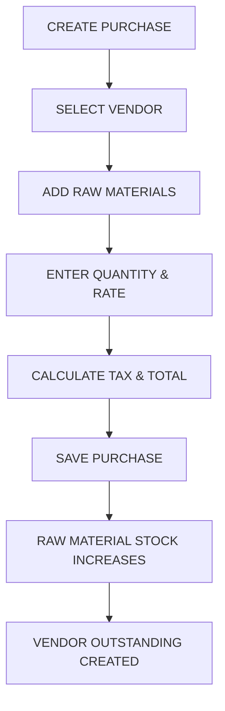

# Stock Management — Requirements (Phase 1)

**Status:** Active — Q-01, Q-02, Q-03, Q-05, Q-05a, Q-09, Q-15, Q-19 and Q-22 answered.
Remaining gaps are marked **[OPEN]**.
**Source:** `docs/business/STOCK_MANAGEMENT_SOURCE_DOCUMENT.md` §2, §5, §6, §8, §21
**Related:** `BUSINESS_RULES.md`, `DATABASE_DESIGN.md`, `API_SPECIFICATION.md`, `UI_FLOW.md`, `TEST_CASES.md`

> This document restates the business source for the Phase 1 scope only, and adds the traceability and
> acceptance detail the source document does not carry. Where it appears to add a requirement, that addition
> is marked **[ENG]** (an engineering necessity) or **[OPEN]** (an unanswered question) — never silently.

---

## 1. Scope

### In scope (Phase 1)

| # | Capability | Source |
| --- | --- | --- |
| R-1 | Vendor master management | §5.1 |
| R-2 | Raw Material master management | §5.5 |
| R-3 | Finished Product master management | §5.6 |
| R-4 | **Unit Master** — dedicated master with CRUD; items reference one unit; **no conversion** (Q-15) | §2, §5.5 |
| R-5 | Purchase entry and history | §6 |
| R-6 | Vendor payment recording and outstanding | §6, §15 |
| R-7 | Raw material and finished product stock views | §8 |
| R-8 | Stock transaction ledger (all movements) | §8, §21 |
| R-9 | Stock adjustment with reason | §8 (type `ADJUSTMENT`) |
| R-10 | Low stock identification | §4, §5.5 |

### Explicitly out of scope in Phase 1

Production (§7), Sales (§10), Projects (§11), Commission (§12), Payments beyond vendor payments (§15),
Reports (§16), Dashboard (§4 — the source document itself marks it "Last priority").

The stock transaction **type enumeration** includes future-phase types (`PRODUCTION_CONSUMPTION`,
`PRODUCTION_OUTPUT`, `SALE`, `SALE_RETURN`) because the ledger design must be stable from the start. Writing
those types is a Phase 2/3 activity. **[ENG]**

---

## 2. R-1 · Vendor Management (§5.1)

**Fields** — `*` = required, exactly as the source document states:

| Field | Required | Notes |
| --- | --- | --- |
| Vendor Name | ✅ | |
| Contact Person | ✅ | |
| Mobile | ✅ | |
| Email | | Validated format if present |
| GST Number | | Format validation **[OPEN]** — is it mandatory for GST-registered vendors? |
| PAN Number | | |
| Address | ✅ | |
| Payment Terms | | e.g. "Net 30 Days" |
| Credit Limit | | Enforcement behaviour is **Q-13** |

**Actions:** Add · View · Edit · **Delete (Reason required)** · Create Purchase · Purchase History ·
Payment History

**Acceptance criteria**

- A vendor cannot be created without the five required fields.
- Deleting a vendor **requires a reason**; the vendor is soft-deleted (ADR-012).
- A soft-deleted vendor cannot be selected for a new purchase, but remains visible on historical purchases.
- Vendor access is governed by the `vendor.*` permissions; there is no tenant scoping (ADR-014). **[ENG]**
- Purchase History shows all purchases for that vendor; Payment History shows all payments.
- Outstanding balance is **derived** from purchases minus payments — not a manually editable field. **[ENG]**

---

## 3. R-2 · Raw Material Management (§5.5)

| Field | Required | Notes |
| --- | --- | --- |
| Material Name | ✅ | |
| Item Code | ✅ | Unique **per Company**; reuse after deletion is **Q-06** |
| Unit | ✅ | From the Unit master |
| Opening Stock | | Posted as an `ADJUSTMENT` ledger entry, not a stored balance **[ENG]** |
| Minimum Stock | | Low-stock threshold |
| Reorder Level | | Distinct from Minimum Stock — do not merge |
| Default Purchase Price | | Pre-fills the purchase line; always editable |
| GST | | Default GST rate for this material |
| Preferred Vendors | | Zero or more vendors |

**Actions:** Add · Edit · View Stock · Adjust Stock · View Stock History

> **Unit (Q-15, client-confirmed).** Each material references **exactly one** unit from the Unit Master.
> **No unit conversion** — an item is purchased, stored and consumed in the same unit. Do not add conversion
> factors or a base unit.

**Acceptance criteria**

- Item Code is unique within the Company; a duplicate is rejected with a clear message.
- Opening Stock creates a stock transaction of type `ADJUSTMENT` with reason "Opening Stock", so the ledger
  explains the balance from the first unit. **[ENG]** *(Without this, the opening balance is an unexplained
  number that violates ADR-005.)*
- View Stock shows the current balance **per stock location**, which resolves to company, branch or warehouse level per that company (ADR-013). **[ENG]**
- Stock History shows every transaction affecting this material, newest first.
- Adjust Stock requires a reason and writes an `ADJUSTMENT` transaction.

---

## 4. R-3 · Finished Product Management (§5.6)

| Field | Required | Notes |
| --- | --- | --- |
| Product Name | ✅ | |
| Item Code | | Not marked required in the source — **[OPEN]**, recommend making it required for consistency with Raw Material |
| Unit | ✅ | |
| Cost Price | | |
| Dealer Selling Price | | |
| Customer Selling Price | | Dealers and Customers pay different prices |
| GST | | |
| Minimum Stock | | |

**Actions:** Add · Edit · Create · View Stock · Production History · Sales History

**Phase note:** Production History and Sales History are **Phase 2/3**. In Phase 1 the finished product master
exists and its stock is viewable, but no transaction creates finished product stock yet.

---

## 5. R-5 · Purchase Management (§6)

### Flow (from the source document)

### Fields

**Header:** Purchase Number (auto-generated) · Purchase Date · Vendor · Vendor Invoice Number ·
Invoice Date · Stock Location **[ENG, ADR-013]** — optional in the request when the company has a single location

**Lines:** Raw Material · Quantity · Unit · Rate · Discount · GST · Line Total

**Totals:** Total Amount · Paid Amount · Pending Amount · Payment Mode

**Buttons:** Save Draft · Save Purchase · Edit · Record Payment · Print Purchase

### Acceptance criteria

- Purchase Number is generated **server-side**, unique per Company. **[ENG]** Format is **Q-07**.
- A purchase must contain at least one line.
- Quantity and Rate must be greater than zero.
- Only **active raw materials of the same Company** may be selected.
- **Save Draft** does not affect stock and does not create vendor outstanding.
- **Save Purchase** (confirm) atomically: persists the purchase and its lines, writes one `PURCHASE` stock
  transaction **per line**, updates the balance cache, updates vendor outstanding, writes an audit entry.
  All-or-nothing (ADR-005). **[ENG]**
- Editing a confirmed purchase — behaviour is **Q-12**.
- Calculation and rounding rules are **client-confirmed** — see `BUSINESS_RULES.md` `BR-CALC-*` and ADR-015.
  Discount is applied **before** GST; GST type is derived from the place of supply; round-off is shown
  separately as an **entered** signed amount (Q-05a closed — see `Client Doc/046 Hotel Winsome, Ahmedabad.pdf`).

> **[ENG]** The source document's annotation *"(Retrieve data from image or pdf)"* on the purchase form is
> treated as **out of scope** pending confirmation — see **Q-14**.

---

## 6. R-6 · Vendor Payments

- Record a payment against a vendor, optionally against a specific purchase.
- Reduces pending amount and vendor outstanding.
- Payment mode is captured.
- Payments are never deleted; a mistake is reversed by a compensating entry. **[ENG]**
- Payment History is visible from the Vendor screen (§5.1).

---

## 7. R-8 · Stock Transactions (§8, §21)

**The core requirement of this module**, stated verbatim in source §21:

> The system should maintain every stock movement as a stock transaction instead of only storing the current
> stock quantity. This is necessary for accurate stock calculation, audit history and reporting.

**Fields** (§8): Date · Item · Item Type · Transaction Type · Reference Number · Stock In · Stock Out ·
Current Balance

**Transaction types** (§8): `PURCHASE`, `PRODUCTION_CONSUMPTION`, `PRODUCTION_OUTPUT`, `SALE`, `SALE_RETURN`,
`PURCHASE_RETURN`, `DAMAGE`, `ADJUSTMENT`

**Stock effect matrix** (§8):

| Event | Effect |
| --- | --- |
| PURCHASE | Raw Material Stock **+** |
| PRODUCTION | Raw Material Stock **−** |
| PRODUCTION | Finished Product Stock **+** |
| SALE | Finished Product Stock **−** |
| RETURN | Finished Product Stock **+** |

**Acceptance criteria**

- Every stock change, without exception, produces a stock transaction.
- **No `TRANSFER` type (Q-19, client-confirmed).** Stock transfer between locations is **not required** and
  is not in scope. The enum holds exactly the eight types from the source document. **[ENG]**
- The ledger is **append-only** — no update, no delete (ADR-005). **[ENG]**
- Each row references the document that caused it.
- "Current Balance" is presented as a **running balance derived from the ledger**, not stored per row.
  **[ENG]** *(The prototype stores it per row, which breaks if any historical row is inserted or corrected.)*
- The invariant `SUM(in) − SUM(out) = balance` holds per item per warehouse, and is tested.

---

## 8. R-9 · Stock Adjustment

- Requires: item, warehouse, direction (+/−), quantity, and a **mandatory reason**.
- Writes an `ADJUSTMENT` transaction and an audit entry with the actor.
- **[OPEN — Q-11]** Does an adjustment require approval, and who may perform one? This is the most abusable
  operation in an inventory system and needs a rule before Phase 1 ships.

---

## 9. R-10 · Low Stock

- An item is "low stock" when its current balance is **below Minimum Stock**.
- Surfaced as a list and as a dashboard indicator (dashboard itself is low priority per §4).
- **[OPEN]** Is the comparison against Minimum Stock or Reorder Level? The source document defines both but
  never states which drives the alert. Recommend: Minimum Stock triggers the alert, Reorder Level drives a
  future purchase suggestion.

---

## 10. Non-Functional Requirements **[ENG]**

| # | Requirement |
| --- | --- |
| NFR-1 | Every endpoint enforces authentication, permission and resource/scope access (`SECURITY_RULES.md` §2) |
| NFR-2 | Money `numeric(18,2)`, quantity `numeric(18,4)`; no floating point anywhere (ADR-011) |
| NFR-3 | All multi-table writes inside one database transaction |
| NFR-4 | Stock-affecting `POST`s accept an `Idempotency-Key` |
| NFR-5 | All list endpoints paginated, `pageSize` ≤ 100 |
| NFR-6 | UI responsive across phone, tablet, laptop, desktop |
| NFR-7 | Every business-data change writes an audit entry in the same transaction |
| NFR-8 | Developed test-first per `TESTING_RULES.md` |

---

## 11. Traceability

| Req | Source | Business rules | API | Tests |
| --- | --- | --- | --- | --- |
| R-1 Vendor | §5.1 | BR-VEN-* | `/vendors` | TC-VEN-* |
| Calculation & tax | §6, §10 | BR-CALC-* | all document endpoints | TC-CALC-* |
| R-2 Raw Material | §5.5 | BR-RM-* | `/raw-materials` | TC-RM-* |
| R-3 Finished Product | §5.6 | BR-FP-* | `/finished-products` | TC-FP-* |
| R-5 Purchase | §6 | BR-PUR-* | `/purchases` | TC-PUR-* |
| R-6 Vendor Payment | §6, §15 | BR-PAY-* | `/purchases/{id}/payments` | TC-PAY-* |
| R-8 Stock Transaction | §8, §21 | BR-STK-* | `/stock-transactions` | TC-STK-* |
| R-9 Adjustment | §8 | BR-ADJ-* | `/stock-adjustments` | TC-ADJ-* |

Every requirement must be traceable to a source section, a business rule, an endpoint and a test. A row with
a gap is an incomplete requirement.
