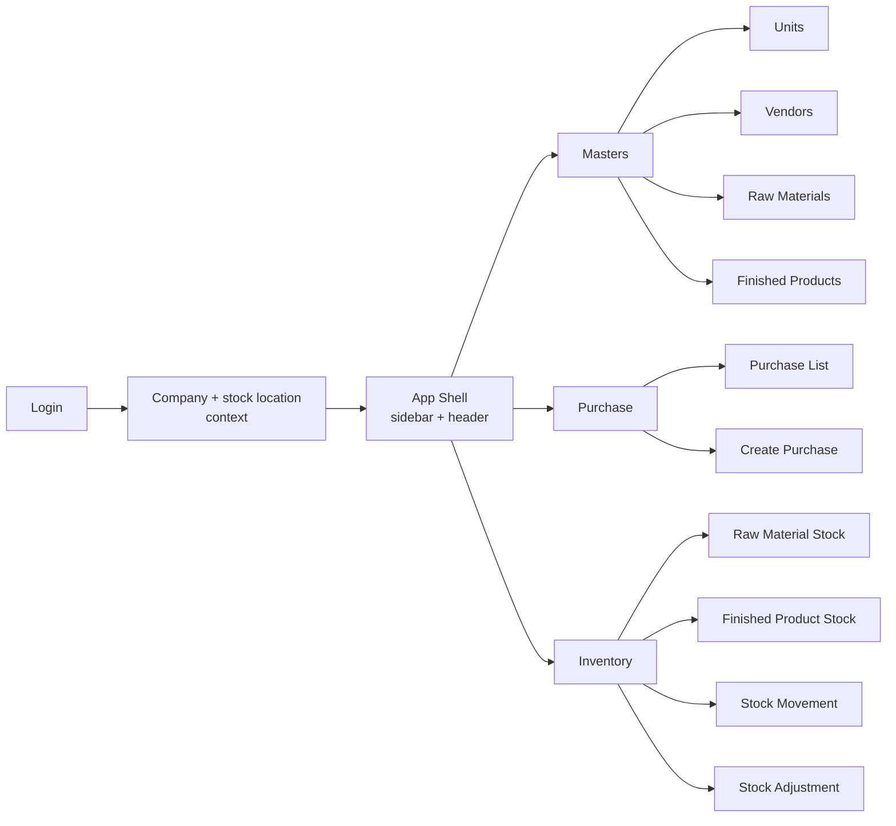
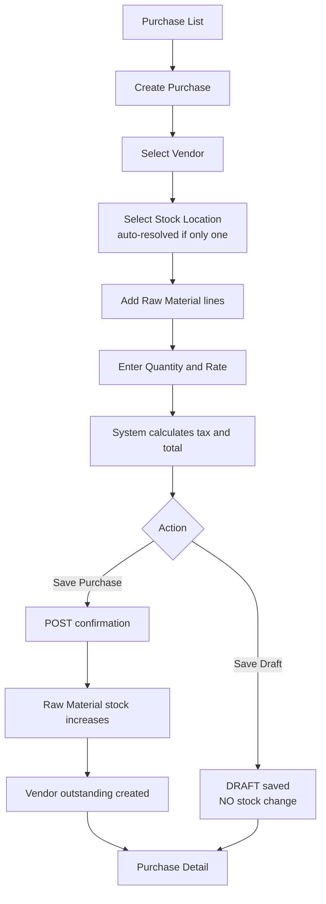
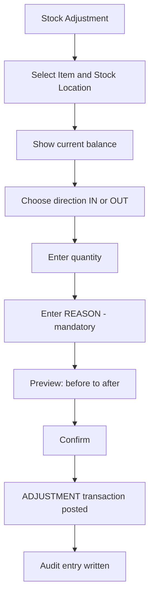

# Stock Management — UI Flow (Phase 1)

**Status:** Draft · **Related:** `FLUTTER_RULES.md`, ADR-008, ADR-010
**Existing implementation:** the screens under `lib/features/` show the intended visual language and are
retained (ADR-010). They are a **UX reference** — new work follows the four-layer architecture (ADR-008).

---

## 1. Screen Inventory (Phase 1 only)

Derived from source document §17 ("Complete Screen Order"), restricted to Phase 1:

| # | Screen | Already exists | Permission |
| --- | --- | --- | --- |
| 1 | Login | ✅ cosmetic only | — |
| 2 | Company + stock-location context selector (ADR-013) | ❌ | — |
| 3 | Masters — Units | ✅ `categories_units_screen.dart` | `unit.view` |
| 4 | Vendors — list | ✅ `vendors_screen.dart` | `vendor.view` |
| 5 | Vendor — create/edit | ✅ (dialog) | `vendor.create` / `.update` |
| 6 | Vendor — detail (purchases, payments) | ❌ | `vendor.view` |
| 7 | Raw Materials — list | ❌ (route exists) | `raw-material.view` |
| 8 | Finished Products — list | ❌ (route exists) | `finished-product.view` |
| 9 | Purchase — list | ✅ `purchase_list_screen.dart` | `purchase.view` |
| 10 | Purchase — create | ✅ `create_purchase_screen.dart` | `purchase.create` |
| 11 | Purchase — detail + record payment | ❌ | `purchase.view` / `payment.create` |
| 12 | Inventory — raw material stock | ✅ `raw_material_stock_screen.dart` | `stock.view` |
| 13 | Inventory — finished product stock | ✅ `finished_product_stock_screen.dart` | `stock.view` |
| 14 | Stock movement (ledger) | ✅ `stock_movement_screen.dart` | `stock.view` |
| 15 | Stock adjustment | ✅ `stock_adjustment_screen.dart` | `stock.adjust` |

**Not in Phase 1** (screens exist in the retained implementation but no Phase 1 backend work targets them): Production, Sales, Projects, Payments hub,
Reports, Dashboard, Customers, Dealers, Architects.

> Source document §17 has a **blank item 10** and jumps from 23 to 30 — see **Q-04**.

---

## 2. Navigation Model

The existing `ErpNavSection` enum plus `ErpSidebar` establishes the navigation pattern and should be
preserved. Phase 1 shows only the sections above; the rest are hidden until their phase opens.

**New in production, absent from the existing implementation:** the stock-location context selector.
Every stock screen is location-specific, so the active stock location must be visible and switchable in the
header. Switching it **invalidates all cached provider state** (`FLUTTER_RULES.md` §3).

Per **ADR-013**, the selector adapts to the company's `stock_scope_level`:

| Company level | What the header shows |
| --- | --- |
| `COMPANY` | **No picker at all** — a single implicit location, resolved server-side |
| `BRANCH` | Branch selector |
| `WAREHOUSE` | Branch selector + warehouse selector |

A single-location customer must never be shown an empty or one-item dropdown. The UI reflects their actual
structure, not the maximal one.

---

## 3. Purchase Creation Flow

Follows the source document §6 flow exactly:

### UX rules

| Rule | Why |
| --- | --- |
| Only active vendors and raw materials of the current Company appear in pickers | BR-VEN-004, BR-PUR-004 |
| Rate pre-fills from `defaultPurchasePrice` but stays editable | BR-RM-006 |
| Totals are displayed from the **server response**, not computed in Dart | BR-PUR-011 — one arithmetic implementation, and it is the authoritative one |
| **Save Draft** is visually distinct from **Save Purchase** | Confirming posts stock and is not casually reversible |
| Confirming shows a summary dialog: "This will add X KG to the selected stock location and create ₹Y outstanding. Continue?" | Stock posting is a consequential action |
| After confirmation the document becomes read-only | BR-PUR-014 ⚠️ Q-12 |
| The confirm request carries an `Idempotency-Key` | A retry on poor connectivity must not double-post stock |

> ⚠️ The existing implementation computes totals client-side in Dart with `double`. New code must not — the
> server is authoritative for totals, and money is decimal (ADR-011).

---

## 4. Stock Movement (Ledger) Screen

The most important read screen in Phase 1. It is the visible proof of BR-STK-001.

**Columns** (source §8): Date · Item · Item Type · Transaction Type · Reference Number · Stock In ·
Stock Out · Running Balance

**Filters:** item, item type, stock location, transaction type, date range, free-text search.

**Rules**

- Read-only. There is **no** edit or delete action anywhere on this screen — the ledger is append-only.
- Reference Number links to its source document.
- Running balance comes from the API (window function), not recomputed in the client.
- Newest first; paginated (never load the whole ledger).
- Transaction types are colour-coded IN/OUT, reusing `ErpStatusBadge`.

The existing `stock_movement_screen.dart` already implements this presentation well and its labelling
(`STOCK IN (PURCHASE)`, `STOCK OUT (PRODUCTION)`) should be preserved.

---

## 5. Stock Adjustment Flow

- The reason field is **mandatory** and free text — no default, no pre-filled value. The user must type why.
- The before → after preview must be shown before confirming.
- Only users holding `stock.adjust` see this screen at all; the API enforces it regardless.

---

## 6. Responsive Behaviour

Per `FLUTTER_RULES.md` §6, every screen is designed at four widths:

| Screen | Compact (< 600) | Medium (600–1023) | Expanded (≥ 1024) |
| --- | --- | --- | --- |
| Vendor list | Cards, bottom nav, FAB | Two-column cards, rail | `ErpDataTable` + sidebar |
| Create purchase | Stepper: vendor → lines → totals | Two panes | Single form, sticky totals |
| Stock movement | Cards per movement (`stock_movement_tile`) | Compact table | Full table with all filters |
| Stock adjustment | Full-screen form | Dialog | Dialog |

Data tables do not survive a phone screen — the compact class uses cards. The existing code already provides
`stock_movement_tile.dart` for this.

---

## 7. State Handling — Mandatory on Every Screen

Every screen handles **four** states, not one:

| State | Requirement |
| --- | --- |
| **Loading** | Skeleton or spinner; never a blank screen |
| **Empty** | Explain and offer the next action: "No vendors yet — Add your first vendor" |
| **Error** | Human message + the `correlationId`, copyable, plus Retry |
| **Data** | The content |

A `403` renders an explicit permission message — **never** a silently empty list, which users report as
missing data and support chases as a phantom bug.

---

## 8. Design System

Reuse the existing components and tokens (promoted as the project design system per ADR-010); do not create
parallel variants:

`ErpButton` · `ErpDataTable` · `ErpHeader` · `ErpSidebar` · `ErpStatusBadge` · `ErpConfirmDialog` ·
`StatCard` · `LowStockBanner` · `StockMovementTile` · `QuickActionCard`
with `AppColors`, `AppSpacing`, `AppRadius`, `AppTextStyles`.

---

## 9. Terminology in the UI

Labels use the source document's exact words (`docs/business/GLOSSARY.md`):

| Use | Never |
| --- | --- |
| Vendor | Supplier |
| Raw Material | Material, Input |
| Finished Product | Product, Item |
| Stock Transaction / Stock Movement | Stock Log, History Entry |
| Purchase | Purchase Order, PO |

The client reads these screens. Using their vocabulary is part of the requirement.
